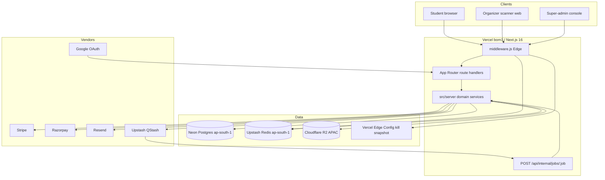
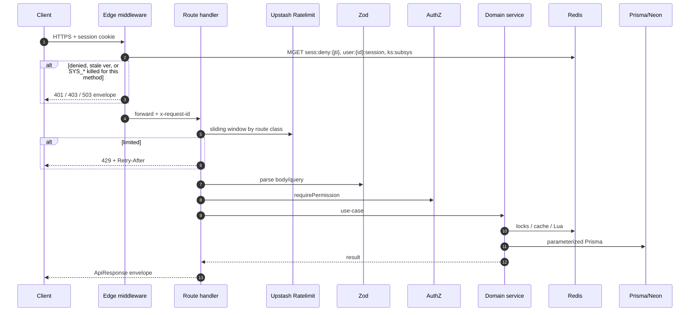
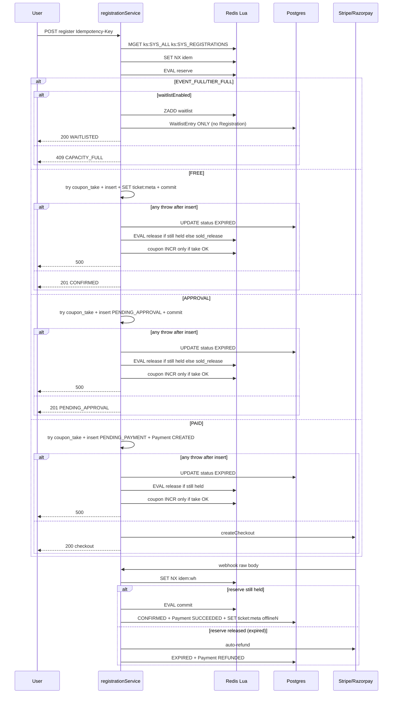

# Opportia Portal — Canonical Backend Architecture & Implementation Spec

| Field | Value |
| :--- | :--- |
| **Title** | Opportia Portal Backend Architecture |
| **Document ID** | `UNC-BE-ARCH-2026-08` |
| **Author** | Engineering (systems architecture) |
| **Date** | 2026-08-26 |
| **Revised** | 2026-08-26 (review loop 1) |
| **Status** | Draft |
| **Audience** | Senior engineers implementing `src/server` and `src/app/api` |
| **Scope** | Production backend for ~100,000 registered campus users |
| **Repo truth** | `H:\OPPORTIA` is frontend-only today. `README.md` is product vision, not implemented code. |
| **Wins over** | `README.md` and public marketing copy wherever they conflict. Public pages are updated in PR 16. |

This file is the **contract**. Implementers must not invent alternate envelopes, auth schemes, Redis key shapes, Lua scripts, or Prisma models. If a product question is not in [Open Questions](#open-questions), use the [Key Decisions](#key-decisions) default.

---

## Overview

Opportia Portal is a campus events / host verification / opportunities / ticketing operating system. The Git repo at `H:\OPPORTIA` currently ships a Next.js 16 App Router + React 19 + Tailwind 4 **UI only**:

- No `prisma/` schema, no `src/app/api`, no `src/server`, no `src/middleware.js`, no Auth.js config.
- `src/app/login/page.js` is a stub (`TODO: Integrate authentication` + `setTimeout`). `src/app/signup/page.js` has a `setTimeout` redirect to `/dashboard` and **no TODO comment**.
- Events, opportunities, host wizard, Aura (`AgentWidget.jsx`), and landing stats are hardcoded arrays.
- `src/app/dashboard/page.js` re-exports the events page.
- `package.json` already lists unused backend libraries: `@prisma/client@^7.9.1`, `prisma@^7.9.1`, `next-auth@^4.24.15`, `stripe`, `razorpay`, `resend`, `pusher` / `pusher-js`, `nodemailer`, `qrcode.react`, `html-to-image`.

This spec is a **full-featured, horizontally scalable backend** colocated with the frontend: Next.js App Router route handlers as HTTP, domain services under `src/server`, Neon PostgreSQL as system of record, and **Upstash Redis as a mandatory** control plane (rate limits, locks, denylists, caches, kill-switches, capacity Lua, check-in Lua).

Design target: 100k registered users, 8–12k concurrent during fests, 2,000 QR scans/min platform-wide. **Online check-in contractual SLO is p95 < 200 ms** via **one** Upstash REST `EVAL` (`checkin_commit`). Offline scanner local verify is **< 10 ms**. See Key Decision 14.

---

## Background & Motivation

### What the frontend actually ships (2026-08-26)

| Route | File | Backend need |
| :--- | :--- | :--- |
| `/` | `src/app/page.js` | Public stats, popular events, reviews, communities |
| `/login` | `src/app/login/page.js` | Google OAuth + email/password. Stub: TODO + `setTimeout`. |
| `/signup` | `src/app/signup/page.js` | Fields: `name`, `email`, `phone`, `location`, `password` + Google. Fake delay then redirect `/dashboard` (**no TODO comment**). |
| `/dashboard` | `src/app/dashboard/page.js` | Alias of `/events`. Becomes authenticated discovery feed. |
| `/events` | `src/app/events/page.js` | Search/filter, RSVP modal (`name`, `email`, `qty` 1–3), QR mock, recap. |
| `/host` | `src/app/host/page.js` | 4-step wizard: title, category, org, date/time, location, **Free / Paid / Approval**, capacity, QR enable. Claims 100+ scans/min offline-first. **Marketing copy also claims SMS + wallet passes — those are v1 non-goals; PR 16 fixes the copy.** |
| `/host/scanner/[eventId]` | **does not exist yet** | Mobile-web scanner (PR 10). Native apps are a non-goal; `/help` copy that mentions a “mobile app” is updated in PR 16. |
| `/opportunities` | `src/app/opportunities/page.js` | Internship/Freelance/Full Time/Bounty; apply: name, email, portfolio URL, note. |
| `/contact` | `src/app/contact/page.js` | Select values: `"Host Verification"`, `"Event Ticketing"`, `"Campus Partnership"`, `"Technical Support"`, `"General Inquiry"`. Mapped to Prisma enums in [Contact category map](#contact-category-map). |
| `/help` | `src/app/help/page.js` | RAG corpus. Copy claims `.edu` auto-verify and a native scanner app — **wrong for v1**; PR 16. |
| `/security` | `src/app/security/page.js` | Claims TLS 1.3, AES-256, **“fully PCI-DSS”**, **99.99% uptime**. Backend honors TLS 1.3, AES-256, **PCI SAQ A**, **99.9%** monthly. PR 16 updates the page. |
| `/privacy`, `/terms`, `/about` | legal/marketing | DPDP erasure, ap-south-1 residency. |
| `AgentWidget` | `src/components/ui/AgentWidget.jsx` | Aura chat + demo booking. Simulated `setTimeout` replies. |

`next.config.mjs` currently allows `images.remotePatterns.hostname: "**"` and sets **no** security headers. Defect; specified below.

### Pain points

1. No source of truth for events, opportunities, or stats.
2. README ticket `sig: registration.id.slice(0, 8)` is not a signature.
3. Capacity races on popular fests.
4. Naive Prisma vs a direct Postgres port dies at fest-day concurrency.
5. README telemetry `os.loadavg()*10` is meaningless on Vercel.
6. PII + KYC cannot live as base64 in Postgres.

---

## Goals & Non-Goals

### Goals

- Complete, secure backend in this repo the App Router UI can call without a separate public API gateway.
- 100k users and fest-day bursts with quantified SLOs.
- Upstash Redis as a required dependency for the ten control-plane jobs listed by product (rate limit, denylist, idempotency, cache, locks/capacity, kill-switch, lockout, waitlist buffer, poll helper, QStash coordination).
- Exhaustive REST coverage: every current UI surface **and** operator/admin/host/student flows.
- Cryptographic QR (server HMAC online; **never** HMAC secret on devices), offline check-in, dual PSP with **currency lock**, host KYC, opportunities ATS, recommendation scoring, admin kill-switch, DPDP deletion, India residency.
- **80%+ line coverage of files touched in each PR** on `src/server` and `src/app/api`; protocol integration tests in the PR that introduces them.

### Non-Goals (v1)

- A Go/Nest/microservices fleet (Key Decision 1).
- Face recognition (`face-api.js` unused). Out of scope.
- Native iOS/Android scanner apps. v1 is **mobile-web** `/host/scanner/[eventId]`.
- Full social graph / DMs. Communities are a catalog.
- Multi-region active-active Postgres. Single Neon **ap-south-1** primary.
- Storing PAN/CVV, or claiming PCI-DSS SAQ D. **SAQ A** via hosted checkout. Public `/security` copy must not say “fully PCI-DSS compliant.”
- LLM tool-calling that mutates events/payments. Aura is RAG-lite + authenticated demo booking.
- Apple/Google Wallet passes and **SMS ticket delivery**. Resend email only. Host page bullets claiming SMS/wallet are copy bugs (PR 16).
- Long-lived **SSE** or Redis `SUBSCRIBE` from Vercel. v1 notifications are **poll**.
- ClamAV as a production runtime. KYC downloads blocked until `malwareStatus=CLEAN` **or** `SKIPPED` with an explicit SUPER_ADMIN ack (Key Decision 22).
- Stripe Connect / Razorpay Route connected accounts. v1 is **platform merchant of record** + manual T+N payouts (Key Decision 6).
- Database Auth.js sessions. JWT only (Key Decision 3).

---

## Scale Targets & Capacity Planning

| Metric | Design point | Notes |
| :--- | :--- | :--- |
| Registered users | 100,000 | From mock "7,645 students" |
| Peak concurrent sessions | 8,000–12,000 | Campus-wide fest weekend |
| Active/upcoming events | ~5,000 | Plus tens of thousands historical |
| Lifetime registrations | 1–3 million rows | ~400 B/row ≈ 0.4–1.2 GB |
| Check-in per gate | ≥ 100 scans/min | Product claim on `/host` |
| Check-in platform-wide | 2,000 scans/min | ~33 scans/s |
| Public read p95 | < 150 ms | Cache-aside Redis |
| Authenticated CRUD p95 | < 300 ms | Neon pooled + Zod + service |
| **Online check-in p95** | **< 200 ms** | One Upstash REST `EVAL` (`checkin_commit`). **Not 80 ms.** |
| Offline scan local | < 10 ms | Manifest membership + local used-set; no network |
| Availability | 99.9% monthly | Redis down: fail-closed **all writes including login**; public cached GETs only |
| Residency | ap-south-1 | Neon Mumbai, Vercel `bom1`, Upstash `ap-south-1`, R2 APAC |

**PR 15 (load) is allowed to fail the 200 ms SLO and force a spec change.** It does not “prove” a number this document pretends is already true. If p95 cannot hold in `bom1`+`ap-south-1` with one EVAL, the follow-up is a tiny always-on regional worker (Fly) talking Redis TCP — not a microservices rewrite. See Alternatives.

### Storage estimates (year-1)

| Store | Volume | Estimate |
| :--- | :--- | :--- |
| Postgres `User` + profile | 100k × ~1.5 KB | ~150 MB |
| Postgres `Event` + tiers + coupons | 50k × ~2 KB | ~100 MB |
| Postgres `Registration` + logs | 3M × ~0.5 KB | ~1.5 GB |
| Postgres `AuditLog` (90-day hot) | ~20M × ~0.4 KB | ~8 GB; archive to R2 after 90 days |
| Redis working set | RL + caches + locks + live used-tickets | **< 2 GB** |
| R2 banners (public) | 50k × 400 KB avg | ~20 GB |
| R2 KYC + resumes (private) | 20k hosts × 3 docs × 1 MB + 100k resumes × 0.5 MB | ~110 GB |

### Traffic model (fest peak hour)

- 10k concurrent browsers × 2 req/min (stats + **notification poll 30–60s**) ≈ **170–330 rps** baseline. (60s poll = ~167 rps; 30s = ~333 rps. Default poll **45s** ≈ 222 rps.)
- Discovery search + RSVP: +200 rps.
- Check-in: 33 rps sustained, 80 rps spike.
- Webhooks: < 20 rps.
- **Peak API: ~600–800 rps.**

### Connection budget

| Resource | Limit | Strategy |
| :--- | :--- | :--- |
| Neon compute (Pro 4 CU, burst 8) | pooler thousands | Runtime: `@neondatabase/serverless` **`Pool`** (WebSocket) + `@prisma/adapter-neon`. `max: 1–3` per isolate. Migrations: `DIRECT_URL`. |
| Prisma clients | 1 per isolate | `src/server/db/prisma.js` singleton. **Never imported from `middleware.js`.** |
| Upstash Redis | REST | `@upstash/redis`. **auto-pipeline enabled globally.** Check-in uses a **single `eval`**, not a pipeline of SETs. |
| Stripe/Razorpay | vendor | Idempotency keys required. |

### Pinning

| Vendor | Region |
| :--- | :--- |
| Vercel | **`bom1` (Mumbai)** — production. Preview may use iad; do not measure check-in SLO there. |
| Neon | **`ap-south-1`** |
| Upstash Redis + QStash | **`ap-south-1`** |
| Cloudflare R2 | APAC (`APAC` jurisdiction) |
| Resend | account in India/EU as available; no PII payload beyond email |

---

## Proposed Design

### Decision: modular monolith in this repo

```
Browser (React 19) ──HTTPS──► Next.js 16 App Router (Vercel bom1)
                                │
                                ├─ Edge middleware (JWT jose + denylist + kill MGET)
                                │    matcher EXCLUDES: static, health, webhooks,
                                │    internal jobs, check-in + check-in/sync
                                │
                                ├─ Route handlers  src/app/api/**/route.js   (HTTP only)
                                │         │
                                │         ▼
                                │   Domain services  src/server/services/*
                                │         │
                                ├─────────┼───────────────┐
                                ▼         ▼               ▼
                         Neon Postgres  Upstash Redis   R2 / Stripe / Razorpay / Resend / QStash
                         (Prisma 7 Pool) (required)     (side effects)
```

Route handlers are thin: parse, authorize, call a service, wrap the envelope. Business rules **do not** live in `route.js`.

Async work is **Upstash QStash** hitting **one** URL family: `POST /api/internal/jobs/:job` with QStash signature verification. There is **no** `/api/webhooks/qstash/` path.

### Architecture diagram



**No SSE box.** Clients poll `GET /api/notifications?since=`.

### Request pipeline

Applies to `/api/*` **except** routes listed in the middleware matcher exclusions.



**Check-in exception:** `POST /api/events/:id/check-in` and `POST /api/events/:id/check-in/sync` **do not run Edge Redis**. Handler (slimmer wrapper): local JWT verify (`jose` → `sub`, `ver`, `jti`) + **Origin CSRF if cookie** (`Origin` exact-match `APP_URL`; **bearer skips CSRF**) + HMAC verify (online only) + **one** `EVAL checkin_commit`. Lua does **not** `GET user:{id}:session`. It checks `sess:deny:{jti}`, `ks:SYS_ALL`, `ks:SYS_CHECKIN`, `user:{id}:ver` (7d), used, and meta in that same EVAL.

### Target tree (new — none of these exist today)

```text
H:\OPPORTIA\
├── prisma/
│   ├── schema.prisma
│   ├── seed.js
│   └── migrations/            # includes raw SQL: partial uniques, pg_trgm, gin
├── prisma.config.ts
├── tests/
│   ├── unit/
│   ├── integration/           # protocol tests live with the introducing PR
│   ├── contract/              # envelope + authz matrix
│   └── load/                  # k6; may fail SLO → spec change
├── src/
│   ├── auth.js                # Auth.js v5 JWT Credentials + Google + MFA
│   ├── middleware.js          # Edge: matcher, jose, Redis MGET
│   ├── app/
│   │   ├── host/scanner/[eventId]/page.js   # mobile-web scanner (PR 10)
│   │   └── api/
│   │       ├── auth/[...nextauth]/route.js
│   │       ├── health/live/route.js
│   │       ├── health/ready/route.js
│   │       ├── webhooks/stripe/route.js     # req.text() raw body
│   │       ├── webhooks/razorpay/route.js
│   │       ├── internal/jobs/[job]/route.js # THE QStash URL
│   │       └── ...
│   └── server/
│       ├── config/env.js
│       ├── config/permissions.js            # Prisma enum ↔ "events:read"
│       ├── config/killSwitch.js             # closed subsystem list
│       ├── db/prisma.js                     # Pool + adapter; node-only
│       ├── redis/client.js                  # auto-pipeline ON
│       ├── redis/keys.js
│       ├── redis/lua/reserve.lua
│       ├── redis/lua/commit.lua
│       ├── redis/lua/release.lua
│       ├── redis/lua/sold_release.lua
│       ├── redis/lua/coupon_take.lua
│       ├── redis/lua/checkin_commit.lua
│       ├── redis/lua/sf_release.lua
│       ├── redis/ratelimit.js
│       ├── http/envelope.js
│       ├── http/errors.js
│       ├── http/withHandler.js
│       ├── http/csrf.js
│       ├── auth/guards.js
│       ├── auth/password.js                 # Argon2id
│       ├── auth/jwt.js                      # jose verify for check-in / middleware
│       ├── tickets/hmac.js                  # server-only HMAC
│       ├── tickets/offline.js               # manifest + Ed25519 sign
│       ├── storage/r2.js
│       ├── payments/stripe.js
│       ├── payments/razorpay.js
│       ├── payments/service.js              # currency → adapter
│       ├── email/resend.js
│       ├── agent/rag.js
│       ├── observability/logger.js
│       ├── observability/metrics.js
│       └── services/*.js
```

**Import boundary:** `src/middleware.js` may import only `src/server/redis/client.js`, `src/server/redis/keys.js`, `src/server/auth/jwt.js`, `src/server/config/killSwitch.js`. ESLint `no-restricted-imports` forbids `@/server/db/prisma` and `@/generated/prisma` from middleware and any `runtime = "edge"` file.

### Runtime rules

- **API routes that import Prisma/Argon2/Stripe:** `export const runtime = "nodejs"`.
- **Middleware:** Edge. JWT parse + Upstash REST `MGET` only.
- **Health live:** no deps, excluded from matcher.
- **Health ready:** Node, pings Neon Pool + Redis.
- **Webhooks:** Node, `req.text()`, excluded from matcher.
- **QStash jobs:** Node, signature only, excluded from matcher.
- **Check-in / sync:** Node, matcher-excluded, one EVAL.

### Cache-aside + stampede protection

Waiters **do not** run `loader()`. Lock holder loads. Waiters retry GET up to 3 times (30 ms, 60 ms, 90 ms) then return **stale** (`GET` previous value if kept as `events:list:{hash}:prev`) or `503 DEPENDENCY_UNAVAILABLE` if none. `JSON.parse` is try/catch; poison values are `DEL`eted.

Lock delete is **compare-and-delete** (Lua: if GET == token then DEL). TTL 5s on `sf:{key}`.

```lua
-- sf_release: KEYS[1]=sf:key  ARGV[1]=token
if redis.call("GET", KEYS[1]) == ARGV[1] then
  return redis.call("DEL", KEYS[1])
end
return 0
```

---

## Stack (concrete versions)

| Layer | Choice | Version / notes |
| :--- | :--- | :--- |
| HTTP | Next.js App Router | `next@16.3.2` |
| UI | React 19 + Tailwind 4 | `react@19.2.8` |
| ORM | Prisma 7 + Neon adapter | `prisma@^7.9.1`, `@prisma/adapter-neon`, `@neondatabase/serverless` **Pool** |
| Postgres | Neon ap-south-1 | pooled + `DIRECT_URL` |
| Auth | **Auth.js v5** (`next-auth@5`) | JWT strategy only. Upgrade unused v4. |
| Passwords | Argon2id `@node-rs/argon2` | not scrypt |
| MFA | TOTP `otplib` | SUPER_ADMIN required before paid ops |
| Validation | Zod 4 | every boundary |
| Redis | Upstash `@upstash/redis` + `@upstash/ratelimit` | auto-pipeline; Lua via `eval` |
| Jobs | QStash | **only** `POST /api/internal/jobs/:job` |
| Payments | Stripe + Razorpay | **currency is destiny** |
| Email | Resend | nodemailer is **dev-only** |
| Realtime | **Poll 45s** | no SSE, no Pusher, no SUBSCRIBE |
| Files | Cloudflare R2 | `@aws-sdk/client-s3` presign |
| QR | HMAC-SHA256 **server-only**; Ed25519 manifest sig | `qrcode.react` renders payload |
| JWT (Edge/check-in) | `jose` | |

---

## API / Interface Changes

### Envelope (all JSON routes except webhooks and health live)

```ts
type ApiResponse<T> = {
  success: boolean
  data?: T
  error?: { code: string; message: string; details?: unknown }
  meta?: { cursor?: string; hasMore?: boolean; total?: number }
  requestId: string
}
```

Webhooks return vendor bodies (`{ received: true }`). Health live may return the envelope or `{ status:"ok" }` — **decision: envelope anyway** so probes can parse `success`.

### Error codes

| HTTP | `error.code` | When |
| :--- | :--- | :--- |
| 400 | `VALIDATION_ERROR` | Zod failure |
| 400 | `INVALID_STATE` | Illegal transition |
| 401 | `UNAUTHENTICATED` | Missing/invalid session |
| **403** | **`EMAIL_UNVERIFIED`** | Mutating route or login when email not verified. **Always 403, never 401.** |
| 403 | `FORBIDDEN` | PBAC miss |
| 403 | `ACCOUNT_LOCKED` | Too many failed logins |
| 403 | `ACCOUNT_DISABLED` | Admin blacklist |
| 403 | `MFA_REQUIRED` | SUPER_ADMIN hitting refund / KYC download / kill-switch without TOTP |
| 404 | `NOT_FOUND` | Missing **or** IDOR hide |
| 409 | `CONFLICT` | Unique active (user, event), coupon, slug |
| 409 | `ALREADY_CHECKED_IN` | Duplicate scan |
| 409 | `CAPACITY_FULL` | Sold out and waitlist off |
| 422 | `PAYMENT_REQUIRED` | Free path on paid event |
| 429 | `RATE_LIMITED` | Redis limiter |
| 503 | `KILL_SWITCH` | Subsystem disabled |
| 503 | `DEPENDENCY_UNAVAILABLE` | Redis required path down |
| 500 | `INTERNAL_ERROR` | Logged; no internals leaked |

**Waitlist is not an error.** HTTP **200** `{ status: "WAITLISTED", position, length }`.

### Pagination

Cursor, never offset on hot lists. `cursor` opaque base64url, `limit` 1–50 default 20.

### Idempotency

Header `Idempotency-Key: <uuid>` **required** on:

`POST /api/events/:id/register`, `POST /api/payments/checkout`, `POST /api/events/:id/check-in`, `POST /api/events/:id/check-in/sync` (key = `deviceId:batchId`), `POST /api/opportunities/:id/apply`, `POST /api/host/apply`, `POST /api/payments/:id/refund`, `POST /api/events/:id/check-in/override`, admin batch.

Redis: `SET idem:{sha256(userId|route|key)} {status,body} NX EX 86400`. Missing header → `400 VALIDATION_ERROR`.

### AuthN transport

**One session SoR: Auth.js v5 JWT.** No Prisma `Session` table. No Auth.js database session strategy.

**Cookie names (exact):**

```js
// src/auth.js
cookies: {
  sessionToken: {
    name: process.env.NODE_ENV === "production"
      ? "__Host-OPPORTIA.session-token"
      : "OPPORTIA.session-token",
    options: { httpOnly: true, sameSite: "lax", path: "/", secure: process.env.NODE_ENV === "production" },
  },
  csrfToken: {
    name: process.env.NODE_ENV === "production"
      ? "__Host-OPPORTIA.csrf-token"
      : "OPPORTIA.csrf-token",
    options: { httpOnly: true, sameSite: "lax", path: "/", secure: process.env.NODE_ENV === "production" },
  },
  callbackUrl: {
    name: process.env.NODE_ENV === "production"
      ? "__Secure-OPPORTIA.callback-url"
      : "OPPORTIA.callback-url",
    options: { sameSite: "lax", path: "/", secure: process.env.NODE_ENV === "production" },
  },
}
```

`__Host-` requires `Secure`, `Path=/`, **no `Domain`**. JWT callback puts `{ sub, jti, ver, role }` in the token (`ver` = `User.tokenVersion`). Max age 7d.

Custom `POST /api/auth/login` **must** mint the cookie via Auth.js `encode()` / `signIn("credentials")` — not a hand-rolled `Set-Cookie`. Same `AUTH_SECRET`.

**CSRF:** Origin exact-match `APP_URL`; reject missing/`null` Origin on mutating cookie requests. Auth.js CSRF cookie for `/api/auth/*`. GET is side-effect free.

**Scanner auth: cookie XOR memory JWT, never both.**

- Mobile-web scanner in the same browser: session cookie (normal USER/ORGANIZER session).
- Dedicated gate device after pairing: `Authorization: Bearer <deviceGrantAccessJwt>` (15 min) + refresh via `POST .../devices/refresh`. **If `Authorization` is present, ignore cookies.**

**Device list:** `GET /api/auth/session` returns `{ current: { jti, issuedAt, userAgent } }` only — **this device**. `POST /api/auth/sessions/revoke-all` increments `tokenVersion` (all devices). There is **no** per-device list of other browsers (no Session table).

**Logout:** denylist current `jti` (`sess:deny:{jti}` TTL remaining) **and** refresh cookie with new `jti` cleared (cookie expire). Logout does **not** bump `tokenVersion` (other devices stay signed in). Password change / reset / admin disable **does** bump `ver`.

**Middleware `ver` check:** `MGET user:{sub}:session` → compare JWT `ver`. Mismatch → 401. Combined with denylist in the same `MGET`.

---

## Middleware matcher

```js
// src/middleware.js
export const config = {
  matcher: [
    "/((?!_next/static|_next/image|favicon.ico|.*\\.(?:svg|png|jpg|jpeg|gif|webp)$).*)",
  ],
}

const SKIP_REDIS = [
  /^\/api\/health\//,
  /^\/api\/webhooks\//,
  /^\/api\/internal\/jobs\//,
  /^\/api\/events\/[^/]+\/check-in$/,
  /^\/api\/events\/[^/]+\/check-in\/sync$/,
]
```

On `SKIP_REDIS` paths: middleware is a no-op (or only sets `x-request-id`). QStash signing is the **only** auth for jobs. Stripe/Razorpay signatures are the only auth for payment webhooks. Health live has no auth and no Redis.

Check-in still authenticates **inside the handler** with `jose` (local).

---

## Authorization model (RBAC + PBAC)

### Roles

| Role | How obtained | Defaults |
| :--- | :--- | :--- |
| `USER` | Signup / Google | Self profile, register, apply, support |
| `ORGANIZER` | Host application `APPROVED` only | USER + own-org events, check-in, ATS, refunds per policy |
| `SUPER_ADMIN` | CLI `scripts/grant-super-admin.js` or another SUPER_ADMIN with `users:grant_admin` + MFA | All. Dual-control logged. |

JWT role is a hint. Mutating handlers (and middleware `ver`) load `user:{id}:session` = `{ tokenVersion, role, disabledAt, permissions, mfaEnabled }`.

### Permission catalog — Prisma enum ↔ wire string

`src/server/config/permissions.js`:

```js
export const P = {
  EVENTS_READ: "events:read",
  EVENTS_CREATE: "events:create",
  EVENTS_UPDATE: "events:update",
  EVENTS_PUBLISH: "events:publish",
  EVENTS_MODERATE: "events:moderate",
  TIERS_WRITE: "tiers:write",
  COUPONS_WRITE: "coupons:write",
  REGISTRATIONS_CREATE: "registrations:create",
  REGISTRATIONS_CANCEL: "registrations:cancel",
  REGISTRATIONS_CHECKIN: "registrations:checkin",
  REGISTRATIONS_APPROVE: "registrations:approve",
  REGISTRATIONS_READ_PII: "registrations:read_pii",
  PAYMENTS_CHECKOUT: "payments:checkout",
  PAYMENTS_REFUND: "payments:refund",
  HOST_APPLY: "host:apply",
  HOST_REVIEW: "host:review",
  KYC_READ: "kyc:read",
  OPP_CREATE: "opportunities:create",
  OPP_APPLY: "opportunities:apply",
  OPP_ATS: "opportunities:ats",
  USERS_READ: "users:read",
  USERS_WRITE: "users:write",
  USERS_BAN: "users:ban",
  USERS_GRANT_ADMIN: "users:grant_admin",
  ADMIN_AUDIT: "admin:audit",
  ADMIN_KILLSWITCH: "admin:killswitch",
  ADMIN_BROADCAST: "admin:broadcast",
  ADMIN_FLAGS: "admin:flags",
  SUPPORT_AGENT: "support:agent",
}
// Prisma enum member name === object key (EVENTS_READ). Wire/PBAC uses the string value.
```

### Per-event managers

`EventManager.role`: `OWNER | EDITOR | SCANNER | VIEWER` as specified previously. SCANNER never receives a full QR payload (reprint is owner-only rotating QR).

### Authz matrix

| Endpoint class | Anon | USER | SCANNER | OWNER | SUPER_ADMIN |
| :--- | :---: | :---: | :---: | :---: | :---: |
| Public event list/detail/stats/reviews | ✓ | ✓ | ✓ | ✓ | ✓ |
| Register / checkout / apply / contact | | ✓* | ✓* | ✓* | ✓ |
| Create event | | | | ✓ (ORGANIZER) | ✓ |
| Check-in / manifest / sync | | | ✓ | ✓ | ✓ |
| Check-in override | | | | ✓ | ✓ |
| Rotating QR payload | | owner | | owner | ✓ |
| Host apply | | ✓ | | | ✓ |
| Host review / KYC download | | | | | ✓ + MFA |
| Kill-switch / refunds | | | | refunds: OWNER+MFA n/a | ✓ + MFA |
| Agent RAG | ✓ (strict RL) | ✓ | ✓ | ✓ | ✓ |
| Agent demo booking | | ✓ | ✓ | ✓ | ✓ |

\* Email verified. IDOR → **404**. `PublicUser` includes `email`/`phoneE164` **only for self**. Attendee export respects `privacyShareEmail`.

---

## Rate-limit classes vs kill-switch subsystems (naming)

These are **different namespaces**. Never call a rate class `AUTH` in kill-switch Redis keys.

**Rate-limit classes** (Upstash Ratelimit; identity = userId else `ip:{hmac}`):

| Class | Limit | Routes |
| :--- | :--- | :--- |
| `RL_AUTH` | 5 / 15 min / IP+email | login, register, forgot, reset, verify resend |
| `RL_AUTH_GOOGLE` | 20 / 15 min / IP | OAuth start |
| `RL_LOCKOUT` | 8 failures / 15 min → lock 30 min | login |
| `RL_PAYMENT` | 10 / min / user | checkout, refund |
| `RL_CHECKIN` | folded into `checkin_commit` Lua (240/min/device) | online scan — **not a separate REST round-trip** |
| `RL_CHECKIN_SYNC` | 30 / min / device | offline batch |
| `RL_SEARCH` | 60 / min | events/opportunities list |
| `RL_CONTACT` | 5 / hour / IP | contact |
| `RL_AGENT` | 20 / min user; 5 / min anon | Aura |
| `RL_WRITE` | 30 / min / user | generic mutating |
| `RL_READ` | 120 / min | default GET |
| `RL_ADMIN` | 60 / min | `/api/admin/*` |
| `RL_WEBHOOK` | 300 / min / IP | signature is real auth |
| `RL_UPLOAD` | 20 / hour / user | presign |
| `RL_POLL` | 6 / min / user | notifications poll (~45s) |

**Kill-switch subsystems** (closed list; Redis `ks:{code}`):

`SYS_AUTH`, `SYS_EVENTS`, `SYS_REGISTRATIONS`, `SYS_CHECKIN`, `SYS_PAYMENTS`, `SYS_HOSTING`, `SYS_OPPORTUNITIES`, `SYS_NOTIFICATIONS`, `SYS_AGENT`, `SYS_UPLOADS`, `SYS_ALL`.

Middleware/handler: `MGET ks:SYS_ALL ks:{relevant}`. Never `KEYS ks:*`.

---

## Data Model Changes

Prisma 7: URL in `prisma.config.ts`. Runtime uses Neon **Pool** adapter.

### `prisma.config.ts`

```ts
import { defineConfig } from "prisma/config"
export default defineConfig({
  schema: "prisma/schema.prisma",
  migrations: { path: "prisma/migrations" },
  datasource: { url: process.env.DIRECT_URL ?? process.env.DATABASE_URL },
})
```

### Canonical `prisma/schema.prisma`

**No `Session` model.** Keep `Account` + `VerificationToken`. Full FKs. Enums not free strings. `Upload` model. Partial uniques in a follow-up SQL migration (Prisma cannot express `WHERE` uniques yet).

```prisma
generator client {
  provider = "prisma-client-js"
  output   = "../src/generated/prisma"
}

datasource db {
  provider = "postgresql"
}

enum Role { USER ORGANIZER SUPER_ADMIN }

enum Permission {
  EVENTS_READ EVENTS_CREATE EVENTS_UPDATE EVENTS_PUBLISH EVENTS_MODERATE
  TIERS_WRITE COUPONS_WRITE
  REGISTRATIONS_CREATE REGISTRATIONS_CANCEL REGISTRATIONS_CHECKIN
  REGISTRATIONS_APPROVE REGISTRATIONS_READ_PII
  PAYMENTS_CHECKOUT PAYMENTS_REFUND
  HOST_APPLY HOST_REVIEW KYC_READ
  OPP_CREATE OPP_APPLY OPP_ATS
  USERS_READ USERS_WRITE USERS_BAN USERS_GRANT_ADMIN
  ADMIN_AUDIT ADMIN_KILLSWITCH ADMIN_BROADCAST ADMIN_FLAGS
  SUPPORT_AGENT
}

enum EventStatus {
  DRAFT PENDING_REVIEW SCHEDULED PUBLISHED UNPUBLISHED
  COMPLETED ARCHIVED SUSPENDED
}

enum AccessType { FREE PAID APPROVAL }

enum RegistrationStatus {
  PENDING_PAYMENT PENDING_APPROVAL CONFIRMED
  CHECKED_IN CANCELLED REFUNDED EXPIRED TRANSFERRED
  // WAITLISTED is NOT a Registration status — waitlist has no Registration row
}

enum InteractionType { VIEW SAVE UNSAVE REGISTER CHECKIN }

enum HostApplicationStatus { PENDING INFO_REQUESTED APPROVED REJECTED WITHDRAWN }

enum KycStatus { NOT_STARTED SUBMITTED NEEDS_INFO VERIFIED REJECTED }

enum OpportunityType { INTERNSHIP FREELANCE FULL_TIME BOUNTY }

enum OpportunityLocation { REMOTE HYBRID ON_CAMPUS }

enum OpportunityStatus { OPEN CLOSED }

enum ApplicationStatus { PENDING REVIEWING SHORTLISTED REJECTED ACCEPTED WITHDRAWN }

enum PaymentProvider { STRIPE RAZORPAY }

enum PaymentStatus {
  CREATED PENDING REQUIRES_ACTION SUCCEEDED FAILED CANCELLED
  REFUNDED PARTIALLY_REFUNDED EXPIRED
}

enum IncidentSeverity { SEV1_CRITICAL SEV2_MAJOR SEV3_MINOR }

enum IncidentSubsystem {
  SYS_AUTH SYS_EVENTS SYS_REGISTRATIONS SYS_CHECKIN SYS_PAYMENTS
  SYS_HOSTING SYS_OPPORTUNITIES SYS_NOTIFICATIONS SYS_AGENT SYS_UPLOADS SYS_ALL
}

enum SupportCategory {
  HOST_VERIFICATION EVENT_TICKETING CAMPUS_PARTNERSHIP
  TECHNICAL_SUPPORT GENERAL_INQUIRY DEMO
}

enum SupportTicketStatus { OPEN PENDING_USER PENDING_AGENT RESOLVED CLOSED }

enum ManagerRole { OWNER EDITOR SCANNER VIEWER }

enum UploadPurpose { BANNER KYC RESUME AVATAR }
enum UploadStatus { INTENT COMPLETE SCAN_PENDING CLEAN REJECTED SKIPPED }
enum MalwareStatus { PENDING CLEAN REJECTED SKIPPED }

enum OrgType { COLLEGE_CLUB NGO COMPANY UNIVERSITY OTHER }

model User {
  id                   String       @id @default(cuid())
  role                 Role         @default(USER)
  permissions          Permission[] @default([])
  name                 String
  email                String       @unique
  emailNormalized      String       @unique
  emailVerified        DateTime?
  passwordHash         String?
  image                String?
  phoneE164            String?
  location             String?
  campusId             String?
  department           String?
  clubAssociation      String?
  dob                  DateTime?    @db.Date
  ageAttested18        Boolean      @default(false)
  bio                  String?      @db.VarChar(280)
  tokenVersion         Int          @default(0)
  onboardingCompleted  Boolean      @default(false)
  preferenceScore      Float        @default(0)
  lastLoginAt          DateTime?
  lastLoginIpHash      String?
  lockedUntil          DateTime?
  failedLoginAttempts  Int          @default(0)
  mfaEnabled           Boolean      @default(false)
  mfaSecretEnc         String?
  privacyHideProfile   Boolean      @default(false)
  privacyShareEmail    Boolean      @default(true)
  notifEmail           Boolean      @default(true)
  notifPush            Boolean      @default(true)
  notifBulletin        Boolean      @default(true)
  notifOpportunities   Boolean      @default(true)
  disabledAt           DateTime?
  disabledReason       String?
  deletedAt            DateTime?
  deleteRequestedAt    DateTime?
  createdAt            DateTime     @default(now())
  updatedAt            DateTime     @updatedAt

  campus               Campus?      @relation(fields: [campusId], references: [id])
  interests            UserInterest[]
  accounts             Account[]
  orgMemberships       OrganizationMember[]
  eventManagers        EventManager[]
  eventsCreated        Event[]              @relation("EventCreator")
  registrations        Registration[]
  waitlistEntries      WaitlistEntry[]
  activities           UserActivity[]
  notifications        Notification[]
  hostApplications     HostApplication[]
  opportunitiesPosted  Opportunity[]        @relation("OpportunityPoster")
  opportunityApps      OpportunityApplication[]
  supportTickets       SupportTicket[]
  reviews              Review[]
  auditActor           AuditLog[]           @relation("AuditActor")
  auditSubject         AuditLog[]           @relation("AuditSubject")
  communications       CommunicationRecipient[]
  savedEvents          SavedEvent[]
  deviceGrants         DeviceGrant[]
  payments             Payment[]
  uploads              Upload[]             @relation("UploadOwner")
  bulletinsAuthored    BulletinUpdate[]
  chatMessages         EventChatMessage[]
  adminNotesAuthored   AdminNote[]
  refundsActor         Refund[]
  incidentsCreated     Incident[]
  kycUploaded          KycDocument[]
  transfersReceived    Registration[]       @relation("TransferTarget")
  consents             ConsentRecord[]

  @@index([role, createdAt])
  @@index([disabledAt])
  @@index([deletedAt])
  @@index([phoneE164])
}

model Account {
  id                String  @id @default(cuid())
  userId            String
  type              String
  provider          String
  providerAccountId String
  refresh_token     String? @db.Text
  access_token      String? @db.Text
  expires_at        Int?
  token_type        String?
  scope             String?
  id_token          String? @db.Text
  session_state     String?
  user              User    @relation(fields: [userId], references: [id], onDelete: Cascade)
  @@unique([provider, providerAccountId])
  @@index([userId])
}

model VerificationToken {
  identifier String
  token      String   @unique
  expires    DateTime
  purpose    String
  @@unique([identifier, token])
}

model ConsentRecord {
  id        String   @id @default(cuid())
  userId    String
  kind      String
  version   String
  acceptedAt DateTime @default(now())
  user      User     @relation(fields: [userId], references: [id], onDelete: Cascade)
  @@index([userId, kind])
}

model Campus {
  id        String   @id @default(cuid())
  name      String
  city      String
  state     String
  country   String   @default("IN")
  slug      String   @unique
  emailDomain String?
  users     User[]
  events    Event[]
  createdAt DateTime @default(now())
}

model InterestTag {
  id     String          @id @default(cuid())
  slug   String          @unique
  label  String
  users  UserInterest[]
  events EventInterest[]
}

model UserInterest {
  userId     String
  interestId String
  user       User        @relation(fields: [userId], references: [id], onDelete: Cascade)
  interest   InterestTag @relation(fields: [interestId], references: [id], onDelete: Cascade)
  @@id([userId, interestId])
}

model Organization {
  id          String   @id @default(cuid())
  name        String
  slug        String   @unique
  type        OrgType
  website     String?
  verifiedAt  DateTime?
  createdAt   DateTime @default(now())
  members     OrganizationMember[]
  events      Event[]
  hostApps    HostApplication[]
  opportunities Opportunity[]
}

model OrganizationMember {
  organizationId String
  userId         String
  role           ManagerRole @default(OWNER)
  organization   Organization @relation(fields: [organizationId], references: [id], onDelete: Cascade)
  user           User         @relation(fields: [userId], references: [id], onDelete: Cascade)
  @@id([organizationId, userId])
}

model Event {
  id                String      @id @default(cuid())
  slug              String      @unique
  title             String
  summary           String?     @db.VarChar(280)
  description       String      @db.Text
  descriptionFmt    String      @default("markdown")
  category          String
  accessType        AccessType  @default(FREE)
  status            EventStatus @default(DRAFT)
  startsAt          DateTime
  endsAt            DateTime?
  timezone          String      @default("Asia/Kolkata")
  location          String
  venueName         String?
  zone              String?
  city              String      @default("Lucknow")
  state             String      @default("Uttar Pradesh")
  country           String      @default("IN")
  lat               Float?
  lng               Float?
  bannerKey         String?
  scheduleMd        String?     @db.Text
  prizePoolMd       String?     @db.Text
  capacity          Int
  waitlistEnabled   Boolean     @default(true)
  qrEnabled         Boolean     @default(true)
  allowTransfer     Boolean     @default(false)
  maxTicketsPerUser Int         @default(3)
  popularityScore   Float       @default(0)
  confirmedCount    Int         @default(0)
  waitlistCount     Int         @default(0)
  publishedAt       DateTime?
  archivedAt        DateTime?
  campusId          String?
  organizationId    String?
  createdById       String
  createdAt         DateTime    @default(now())
  updatedAt         DateTime    @updatedAt

  campus            Campus?       @relation(fields: [campusId], references: [id])
  organization      Organization? @relation(fields: [organizationId], references: [id])
  createdBy         User          @relation("EventCreator", fields: [createdById], references: [id])
  tags              EventTag[]
  interests         EventInterest[]
  keywords          EventKeyword[]
  tiers             TicketTier[]
  coupons           Coupon[]
  registrations     Registration[]
  waitlist          WaitlistEntry[]
  bulletins         BulletinUpdate[]
  chatMessages      EventChatMessage[]
  managers          EventManager[]
  activityLogs      EventActivityLog[]
  analytics         EventAnalytic[]
  reviews           Review[]
  recap             EventRecap?
  gates             CheckInGate[]
  savedBy           SavedEvent[]
  activities        UserActivity[]

  @@index([status, startsAt])
  @@index([category, status])
  @@index([organizationId, status])
  @@index([createdById])
  @@index([popularityScore(sort: Desc)])
  @@index([city, startsAt])
}

model EventTag {
  eventId String
  tag     String
  event   Event @relation(fields: [eventId], references: [id], onDelete: Cascade)
  @@id([eventId, tag])
  @@index([tag])
}

model EventKeyword {
  eventId String
  keyword String
  event   Event @relation(fields: [eventId], references: [id], onDelete: Cascade)
  @@id([eventId, keyword])
}

model EventInterest {
  eventId    String
  interestId String
  event      Event       @relation(fields: [eventId], references: [id], onDelete: Cascade)
  interest   InterestTag @relation(fields: [interestId], references: [id], onDelete: Cascade)
  @@id([eventId, interestId])
}

model EventRecap {
  eventId   String  @id
  recapText String  @db.Text
  published Boolean @default(false)
  event     Event   @relation(fields: [eventId], references: [id], onDelete: Cascade)
}

model TicketTier {
  id            String   @id @default(cuid())
  eventId       String
  name          String
  description   String?
  priceMinor    Int      @default(0)
  currency      String   @default("INR")
  quantityTotal Int
  quantitySold  Int      @default(0)
  salesStartAt  DateTime?
  salesEndAt    DateTime?
  isDefault     Boolean  @default(false)
  event         Event    @relation(fields: [eventId], references: [id], onDelete: Cascade)
  registrations Registration[]
  @@index([eventId])
}

model Coupon {
  id             String    @id @default(cuid())
  eventId        String
  code           String
  percentOff     Int?
  amountOff      Int?
  currency       String    @default("INR")
  maxRedemptions Int?
  redeemed       Int       @default(0)
  minTickets     Int       @default(1)
  startsAt       DateTime?
  endsAt         DateTime?
  disabledAt     DateTime?
  event          Event     @relation(fields: [eventId], references: [id], onDelete: Cascade)
  registrations  Registration[]
  @@unique([eventId, code])
}

model Registration {
  id              String             @id @default(cuid())
  publicCode      String             @unique
  userId          String
  eventId         String
  ticketTierId    String?
  couponId        String?
  status          RegistrationStatus @default(PENDING_PAYMENT)
  quantity        Int                @default(1)
  amountMinor     Int                @default(0)
  currency        String             @default("INR")
  qrNonce         String             @unique // frozen offlineN at confirm; NEVER updated on /qr rotate
  qrExpiresAt     DateTime           // event.endsAt + 12h (offline). Rotating online exp is Redis-only.
  checkedInAt     DateTime?
  checkedInGateId String?
  cancelledAt     DateTime?
  transferredToId String?
  teamName        String?
  track           String?
  registeredAt    DateTime           @default(now())
  updatedAt       DateTime           @updatedAt

  user            User               @relation(fields: [userId], references: [id])
  event           Event              @relation(fields: [eventId], references: [id])
  ticketTier      TicketTier?        @relation(fields: [ticketTierId], references: [id])
  coupon          Coupon?            @relation(fields: [couponId], references: [id])
  transferredTo   User?              @relation("TransferTarget", fields: [transferredToId], references: [id], onDelete: SetNull)
  logs            RegistrationLog[]
  payment         Payment?

  @@index([eventId, status])
  @@index([userId, status])
  @@index([eventId, checkedInAt])
  @@index([publicCode])
  @@index([qrNonce])
}

model RegistrationLog {
  id             String       @id @default(cuid())
  registrationId String
  actorId        String?
  action         String
  fromStatus     String?
  toStatus       String?
  meta           Json?
  createdAt      DateTime     @default(now())
  registration   Registration @relation(fields: [registrationId], references: [id], onDelete: Cascade)
  @@index([registrationId, createdAt])
}

model WaitlistEntry {
  id         String    @id @default(cuid())
  eventId    String
  userId     String
  position   Int
  createdAt  DateTime  @default(now())
  promotedAt DateTime?
  event      Event     @relation(fields: [eventId], references: [id], onDelete: Cascade)
  user       User      @relation(fields: [userId], references: [id], onDelete: Cascade)
  @@unique([eventId, userId])
  @@index([eventId, position])
}

model EventManager {
  eventId String
  userId  String
  role    ManagerRole
  event   Event @relation(fields: [eventId], references: [id], onDelete: Cascade)
  user    User  @relation(fields: [userId], references: [id], onDelete: Cascade)
  @@id([eventId, userId])
}

model EventActivityLog {
  id        String   @id @default(cuid())
  eventId   String
  actorId   String?
  action    String
  payload   Json?
  createdAt DateTime @default(now())
  event     Event    @relation(fields: [eventId], references: [id], onDelete: Cascade)
  @@index([eventId, createdAt])
}

model EventAnalytic {
  id        String   @id @default(cuid())
  eventId   String
  date      DateTime @db.Date
  views     Int      @default(0)
  saves     Int      @default(0)
  registers Int      @default(0)
  checkins  Int      @default(0)
  event     Event    @relation(fields: [eventId], references: [id], onDelete: Cascade)
  @@unique([eventId, date])
}

model BulletinUpdate {
  id        String   @id @default(cuid())
  eventId   String
  title     String
  content   String   @db.Text
  pinned    Boolean  @default(false)
  createdBy String
  createdAt DateTime @default(now())
  event     Event    @relation(fields: [eventId], references: [id], onDelete: Cascade)
  author    User     @relation(fields: [createdBy], references: [id])
  @@index([eventId, createdAt])
}

model EventChatMessage {
  id        String    @id @default(cuid())
  eventId   String
  userId    String
  body      String    @db.VarChar(1000)
  hiddenAt  DateTime?
  createdAt DateTime  @default(now())
  event     Event     @relation(fields: [eventId], references: [id], onDelete: Cascade)
  user      User      @relation(fields: [userId], references: [id], onDelete: Cascade)
  @@index([eventId, createdAt])
}

model CheckInGate {
  id        String        @id @default(cuid())
  eventId   String
  name      String
  event     Event         @relation(fields: [eventId], references: [id], onDelete: Cascade)
  grants    DeviceGrant[]
}

model DeviceGrant {
  id          String       @id @default(cuid())
  userId      String
  gateId      String
  deviceHash  String
  refreshHash String
  expiresAt   DateTime
  revokedAt   DateTime?
  createdAt   DateTime     @default(now())
  user        User         @relation(fields: [userId], references: [id], onDelete: Cascade)
  gate        CheckInGate  @relation(fields: [gateId], references: [id], onDelete: Cascade)
  @@index([userId])
}

model UserActivity {
  id              String          @id @default(cuid())
  userId          String
  eventId         String
  interactionType InteractionType
  createdAt       DateTime        @default(now())
  user            User            @relation(fields: [userId], references: [id], onDelete: Cascade)
  event           Event           @relation(fields: [eventId], references: [id], onDelete: Cascade)
  @@index([userId, createdAt])
  @@index([eventId, interactionType])
  // SAVE/REGISTER uniqueness is a partial unique index in SQL, not on VIEW
}

model SavedEvent {
  userId    String
  eventId   String
  createdAt DateTime @default(now())
  user      User     @relation(fields: [userId], references: [id], onDelete: Cascade)
  event     Event    @relation(fields: [eventId], references: [id], onDelete: Cascade)
  @@id([userId, eventId])
}

model HostApplication {
  id               String                @id @default(cuid())
  userId           String
  organizationId   String?
  organizationName String
  organizationType OrgType
  website          String?
  description      String                @db.Text
  status           HostApplicationStatus @default(PENDING)
  kycStatus        KycStatus             @default(NOT_STARTED)
  kycProvider      String?
  kycReferenceId   String?
  submittedAt      DateTime              @default(now())
  decidedAt        DateTime?
  decidedById      String?
  user             User                  @relation(fields: [userId], references: [id])
  organization     Organization?         @relation(fields: [organizationId], references: [id])
  documents        KycDocument[]
  notes            AdminNote[]
  @@index([userId, submittedAt])
  @@index([status, submittedAt])
}

model KycDocument {
  id            String          @id @default(cuid())
  applicationId String
  uploadId      String          @unique
  type          String
  uploadedById  String
  createdAt     DateTime        @default(now())
  application   HostApplication @relation(fields: [applicationId], references: [id], onDelete: Cascade)
  upload        Upload          @relation(fields: [uploadId], references: [id])
  uploadedBy    User            @relation(fields: [uploadedById], references: [id])
  @@index([applicationId])
}

model AdminNote {
  id            String          @id @default(cuid())
  applicationId String
  authorId      String
  body          String          @db.Text
  createdAt     DateTime        @default(now())
  application   HostApplication @relation(fields: [applicationId], references: [id], onDelete: Cascade)
  author        User            @relation(fields: [authorId], references: [id])
}

model Opportunity {
  id             String               @id @default(cuid())
  slug           String               @unique
  title          String
  company        String
  type           OpportunityType
  locationType   OpportunityLocation
  locationText   String?
  payText        String
  payMinor       Int?
  currency       String               @default("USD")
  description    String               @db.Text
  skills         String[]
  status         OpportunityStatus    @default(OPEN)
  posterId       String
  organizationId String?
  createdAt      DateTime             @default(now())
  updatedAt      DateTime             @updatedAt
  poster         User                 @relation("OpportunityPoster", fields: [posterId], references: [id])
  organization   Organization?        @relation(fields: [organizationId], references: [id])
  applications   OpportunityApplication[]
  @@index([type, status])
  @@index([createdAt])
}

model OpportunityApplication {
  id            String            @id @default(cuid())
  opportunityId String
  userId        String
  portfolioUrl  String?
  note          String?           @db.VarChar(2000)
  resumeUploadId String?
  status        ApplicationStatus @default(PENDING)
  createdAt     DateTime          @default(now())
  updatedAt     DateTime          @updatedAt
  opportunity   Opportunity       @relation(fields: [opportunityId], references: [id])
  user          User              @relation(fields: [userId], references: [id])
  resume        Upload?           @relation(fields: [resumeUploadId], references: [id])
  @@unique([opportunityId, userId])
  @@index([opportunityId, status])
}

model Notification {
  id        String    @id @default(cuid())
  userId    String
  type      String
  title     String
  body      String
  href      String?
  readAt    DateTime?
  createdAt DateTime  @default(now())
  user      User      @relation(fields: [userId], references: [id], onDelete: Cascade)
  @@index([userId, readAt, createdAt])
  @@index([userId, createdAt])
}

model Review {
  id         String   @id @default(cuid())
  userId     String
  eventId    String?
  rating     Int
  body       String   @db.VarChar(1000)
  authorRole String?
  published  Boolean  @default(false)
  createdAt  DateTime @default(now())
  user       User     @relation(fields: [userId], references: [id])
  event      Event?   @relation(fields: [eventId], references: [id])
  @@index([published, createdAt])
}

model Payment {
  id             String          @id @default(cuid())
  userId         String
  registrationId String?         @unique
  provider       PaymentProvider
  providerRef    String          @unique
  status         PaymentStatus   @default(CREATED)
  amountMinor    Int
  currency       String
  couponCode     String?
  reserveId      String?
  rawLastEvent   String?
  createdAt      DateTime        @default(now())
  updatedAt      DateTime        @updatedAt
  user           User            @relation(fields: [userId], references: [id])
  registration   Registration?   @relation(fields: [registrationId], references: [id])
  refunds        Refund[]
  @@index([userId, createdAt])
  @@index([status])
}

model Refund {
  id          String   @id @default(cuid())
  paymentId   String
  amountMinor Int
  reason      String?
  providerRef String?
  actorId     String
  createdAt   DateTime @default(now())
  payment     Payment  @relation(fields: [paymentId], references: [id])
  actor       User     @relation(fields: [actorId], references: [id])
}

model SupportTicket {
  id        String              @id @default(cuid())
  userId    String?
  email     String
  name      String
  category  SupportCategory
  subject   String
  status    SupportTicketStatus @default(OPEN)
  createdAt DateTime            @default(now())
  user      User?               @relation(fields: [userId], references: [id])
  messages  TicketMessage[]
}

model TicketMessage {
  id        String        @id @default(cuid())
  ticketId  String
  authorId  String?
  fromEmail String?
  body      String        @db.Text
  createdAt DateTime      @default(now())
  ticket    SupportTicket @relation(fields: [ticketId], references: [id], onDelete: Cascade)
}

model AdminCommunication {
  id          String   @id @default(cuid())
  subject     String
  body        String   @db.Text
  audience    String
  createdById String
  createdAt   DateTime @default(now())
  recipients  CommunicationRecipient[]
}

model CommunicationRecipient {
  communicationId String
  userId          String
  sentAt          DateTime?
  readAt          DateTime?
  communication   AdminCommunication @relation(fields: [communicationId], references: [id], onDelete: Cascade)
  user            User               @relation(fields: [userId], references: [id], onDelete: Cascade)
  @@id([communicationId, userId])
}

model AuditLog {
  id         String   @id @default(cuid())
  actorId    String?
  subjectId  String?
  action     String
  entityType String
  entityId   String
  ipHash     String?
  userAgent  String?
  before     Json?
  after      Json?
  createdAt  DateTime @default(now())
  actor      User?    @relation("AuditActor", fields: [actorId], references: [id])
  subject    User?    @relation("AuditSubject", fields: [subjectId], references: [id])
  @@index([entityType, entityId, createdAt])
  @@index([actorId, createdAt])
  @@index([createdAt])
}

model FeatureFlag {
  name        String   @id
  enabled     Boolean  @default(false)
  payload     Json?
  updatedById String?
  updatedAt   DateTime @updatedAt
}

model Incident {
  id          String             @id @default(cuid())
  severity    IncidentSeverity
  subsystem   IncidentSubsystem
  title       String
  body        String             @db.Text
  open        Boolean            @default(true)
  createdById String
  createdAt   DateTime           @default(now())
  resolvedAt  DateTime?
  createdBy   User               @relation(fields: [createdById], references: [id])
}

model SystemTelemetrySnapshot {
  id             String   @id @default(cuid())
  timestamp      DateTime @default(now())
  apiLatencyP50  Int
  apiLatencyP95  Int
  errorRatePct   Float
  requestCount   Int
  checkinPerMin  Int
  paymentSuccess Int
  paymentFail    Int
  redisErrors    Int
  dbErrors       Int
  qstashLagMs    Int
  readyOk        Boolean
  @@index([timestamp])
}

model HelpArticle {
  id        String   @id @default(cuid())
  slug      String   @unique
  title     String
  body      String   @db.Text
  category  String
  published Boolean  @default(true)
  updatedAt DateTime @updatedAt
}

model AgentConversation {
  id        String         @id @default(cuid())
  userId    String?
  ipHash    String?
  createdAt DateTime       @default(now())
  messages  AgentMessage[]
}

model AgentMessage {
  id             String            @id @default(cuid())
  conversationId String
  role           String
  content        String            @db.Text
  createdAt      DateTime          @default(now())
  conversation   AgentConversation @relation(fields: [conversationId], references: [id], onDelete: Cascade)
}

model Upload {
  id            String        @id @default(cuid())
  ownerId       String
  purpose       UploadPurpose
  status        UploadStatus  @default(INTENT)
  malwareStatus MalwareStatus @default(PENDING)
  storageKey    String
  contentType   String
  byteSize      Int
  sha256        String
  skippedAckBy  String?
  skippedAckAt  DateTime?
  createdAt     DateTime      @default(now())
  owner         User          @relation("UploadOwner", fields: [ownerId], references: [id])
  kycDocs       KycDocument[]
  oppApps       OpportunityApplication[]
  @@index([ownerId, purpose, createdAt])
}

model KillSwitchState {
  subsystem   IncidentSubsystem @id
  enabled     Boolean           @default(false)
  reason      String?
  updatedById String?
  updatedAt   DateTime          @updatedAt
}
```

### SQL migrations Prisma cannot express (PR 1)

```sql
CREATE EXTENSION IF NOT EXISTS pg_trgm;

CREATE UNIQUE INDEX registration_active_user_event
  ON "Registration" ("userId", "eventId")
  WHERE status NOT IN ('TRANSFERRED', 'CANCELLED', 'EXPIRED', 'REFUNDED');

CREATE UNIQUE INDEX host_app_one_open
  ON "HostApplication" ("userId")
  WHERE status IN ('PENDING', 'INFO_REQUESTED');

CREATE UNIQUE INDEX user_activity_save_once
  ON "UserActivity" ("userId", "eventId", "interactionType")
  WHERE "interactionType" IN ('SAVE', 'REGISTER');

CREATE INDEX event_title_trgm ON "Event" USING gin (title gin_trgm_ops);

CREATE INDEX audit_log_created_brin ON "AuditLog" USING brin ("createdAt");
```

`Event.capacity` is the **hard cap**. Constraint enforced in service + Lua, plus:

```sql
-- cannot easily CHECK sum(tiers) in SQL across rows; service-enforced:
-- sum(TicketTier.quantityTotal) <= Event.capacity on every tier write.
```

Audit archive: nightly QStash copies rows `createdAt < now()-90d` to `r2://audit/{yyyy}/{mm}/{dd}.jsonl` then `DELETE`. No Postgres partitioning in v1 (BRIN is enough at 20M).

VIEW writes: sampled in Redis (`act:view:{userId}:{eventId}` NX 3600); **no unique** on VIEW rows.

**Opaque actor ids (no Prisma relation):** `TicketMessage.authorId`, `AdminCommunication.createdById`, `HostApplication.decidedById`, `Upload.skippedAckBy`, `FeatureFlag.updatedById`, `KillSwitchState.updatedById`, `EventActivityLog.actorId` are optional User ids stored without FK. DPDP `user.erase` nulls them. Do not invent extra join tables.

### Migration strategy

Expand/contract. Neon branch per PR. Registrations/payments append-only.

---

## Redis key catalog

Prefix: `unc:` prod, `unc:dev:` / `unc:test:` else.

| Key pattern | Type | TTL | Owner | Purpose |
| :--- | :--- | :--- | :--- | :--- |
| `rl:{class}:{id}` | hash | window | ratelimit | Sliding window |
| `login:fail:email:{sha256}` | STRING int | 900 | auth | Failures |
| `login:fail:ip:{sha256}` | STRING int | 900 | auth | Stuffing |
| `login:lock:{userId}` | STRING | 1800 | auth | Lock flag |
| `sess:deny:{jti}` | STRING `1` | JWT remaining (max 7d) | auth | Logout / that jti. **Inside checkin_commit EVAL.** |
| `user:{id}:session` | JSON | 60 | auth | `{tokenVersion,role,disabledAt,permissions,mfaEnabled}` — middleware/CRUD only. **Check-in must not GET this.** |
| `user:{id}:ver` | STRING int | 7d | auth | `tokenVersion` only. SET on login and on `tokenVersion++`. Check-in EVAL compares JWT `ver`. |
| `user:{id}:profile` | JSON | 120 | userService | Self profile |
| `events:list:{filterHash}` | JSON | 30 | eventService | Public list |
| `events:list:{filterHash}:prev` | JSON | 120 | eventService | Stale for stampede waiters |
| `events:detail:{id}` | JSON | 60 | eventService | Detail |
| `events:slug:{slug}` | STRING id | 3600 | eventService | Slug → id |
| `stats:public` | JSON | 30 | stats | Landing counters |
| `rec:feed:{userId}` | JSON | 120 | recs | Ranked ids |
| `rec:lock:{userId}` | STRING | 10 | recs | Recompute SF |
| `lock:event:{eventId}:capacity` | STRING token | 5 | unused if Lua | Prefer Lua; keep for non-Lua admin |
| `reserve:event:{eventId}:{reserveId}` | HASH `qty,tier,state,eventId` | **none** while `held`; 7d after `committed`/`released` | registration | Paid/free hold. **No EXPIRE while held.** |
| `reserve:deadlines` | ZSET score=unixDeadline member=`eventId:reserveId` | none (members ZREM'd) | registration / `reserve.sweep` | Sole timeout index |
| `reserve:deadline:{reserveId}` | STRING `{eventId,tierKey,qty}` | **none** (deleted by sweep/commit/release) | registration | Lookup payload for sweeper |
| `cap:{eventId}` | HASH `sold,held,limit` | event life | registration | Event cap |
| `cap:tier:{tierId}` | HASH `sold,held,limit` | event life | registration | Tier cap |
| `hot:events` | SET | 86400 | reconcile | Hot event ids |
| `waitlist:event:{eventId}` | ZSET score=ts | none | registration | FIFO, member=userId |
| `coupon:{eventId}:{code}` | HASH `remaining` | **none** (or EXPIRE at `event.endsAt + 7d`, set on create/update) | registration | Fast remaining. **Never TTL 3600.** |
| `ticket:used:{regId}` | STRING JSON `{gate,at,n}` | 7d after event end | checkIn | Replay. **checkin_commit KEYS[1]** |
| `ticket:nonce:{onlineN}` | STRING `rid` | 90 | checkIn | Bind for current rotating QR. `GET /qr` only. Not used offline. |
| `ticket:meta:{rid}` | JSON `{uid,name,eid,qty,onlineN,offlineN}` | until event+7d | checkIn | Confirm-time: set `offlineN` once + `onlineN` empty until first `/qr`. **Never store a single `n`.** |
| `manifest:{eventId}:ver` | STRING int | 86400 | checkIn | Manifest generation |
| `ks:{SYS_*}` | STRING **non-empty reason** | none (DEL to clear) | admin | Kill **ON** = `SET ks:{code} {reason}` (reason required, never `""`). **OFF** = `DEL ks:{code}`. Lua `if GET then` is then correct. |
| `flag:{name}` | JSON | 10 | admin | Flag cache |
| `idem:{hash}` | JSON envelope | 86400 | withHandler | POST replay |
| `idem:wh:{provider}:{ref}` | STRING `1` | 7d | payments | Webhook event id |
| `notif:inbox:{userId}` | LIST | 200 cap | notifications | Hot unread heads |
| `sf:{key}` | STRING token | 5 | cache | Singleflight |
| `geo:ban:{iphash}` | STRING | 3600 | admin | Manual |
| `agent:conv:{id}` | JSON | 3600 | agent | Short memory |
| `opp:list:{hash}` | JSON | 60 | opportunities | Public list |
| `act:view:{userId}:{eventId}` | STRING | 3600 | recs | VIEW sample NX |
| `ed25519:pub` | STRING | 3600 | tickets | Cached verify pubkey for manifests |

### Redis failure modes

| Path | Redis down |
| :--- | :--- |
| **All writes** including **login, register, checkout, check-in, contact, agent mutate** | **Fail closed** `503 DEPENDENCY_UNAVAILABLE` |
| Public **GET** list/detail/stats | Serve **cache if present**; else 503 (no stampede into Postgres from 10k clients). Health live still 200. |
| Rate limit | Same as writes: fail closed on mutating; GETs skip RL if Redis down |
| Kill-switch | See [Kill-switch protocol](#kill-switch-protocol) |
| Idempotency | Fail closed on payments/register |
| Check-in online | Fail closed. **Production gates run offline mode** (manifest). |

---

## Domain protocols

### Capacity model (Key Decision 16)

- `Event.capacity` is the **hard cap**.
- `sum(TicketTier.quantityTotal) <= Event.capacity` on create/update tier (400 `VALIDATION_ERROR` otherwise).
- Lua always keys **both** `cap:{eventId}` and `cap:tier:{tierId}`.
- Free default tier: `quantityTotal = Event.capacity`, `priceMinor = 0`.

**Paid hold TTL = 25 minutes** (UPI). Free/approval hold TTL = 120 seconds (commit is in-request).

### Lua trio — `reserve` / `commit` / `release`

Scripts live in `src/server/redis/lua/`. Loaded by SHA.

`KEYS[1]=cap:{eventId}` `KEYS[2]=cap:tier:{tierId}` `KEYS[3]=reserve:{eventId}:{reserveId}` `KEYS[4]=reserve:deadlines` `KEYS[5]=reserve:deadline:{reserveId}`.

**`reserve.lua`** (`ARGV`: qty, deadlineUnix, member=`eventId:reserveId`, deadlineJson):

```lua
-- src/server/redis/lua/reserve.lua
-- Does NOT EXPIRE KEYS[3]. Sweeper is the only timeout path that calls release.
local qty = tonumber(ARGV[1])
local deadline = tonumber(ARGV[2])
local member = ARGV[3]
local eSold = tonumber(redis.call("HGET", KEYS[1], "sold") or "0")
local eHeld = tonumber(redis.call("HGET", KEYS[1], "held") or "0")
local eLim  = tonumber(redis.call("HGET", KEYS[1], "limit") or "0")
local tSold = tonumber(redis.call("HGET", KEYS[2], "sold") or "0")
local tHeld = tonumber(redis.call("HGET", KEYS[2], "held") or "0")
local tLim  = tonumber(redis.call("HGET", KEYS[2], "limit") or "0")
if eSold + eHeld + qty > eLim then return {0, "EVENT_FULL"} end
if tSold + tHeld + qty > tLim then return {0, "TIER_FULL"} end
if redis.call("EXISTS", KEYS[3]) == 1 then return {0, "DUP_RESERVE"} end
redis.call("HINCRBY", KEYS[1], "held", qty)
redis.call("HINCRBY", KEYS[2], "held", qty)
redis.call("HSET", KEYS[3], "qty", qty, "tier", KEYS[2], "state", "held", "eventCap", KEYS[1])
redis.call("ZADD", KEYS[4], deadline, member)
redis.call("SET", KEYS[5], ARGV[4])
return {1, "OK"}
```

Deadline: paid = `now+1500` (25 min UPI); free/approval = `now+120` (in-request commit; sweeper is a safety net).

**`commit.lua`** (held → sold). Free/approval path **must** call this in the same request after Prisma insert. Paid path calls this from the webhook **only while `state=held`**.

```lua
-- src/server/redis/lua/commit.lua
if redis.call("HGET", KEYS[3], "state") ~= "held" then return {0, "NO_RESERVE"} end
local qty = tonumber(redis.call("HGET", KEYS[3], "qty"))
redis.call("HINCRBY", KEYS[1], "held", -qty)
redis.call("HINCRBY", KEYS[2], "held", -qty)
redis.call("HINCRBY", KEYS[1], "sold", qty)
redis.call("HINCRBY", KEYS[2], "sold", qty)
redis.call("HSET", KEYS[3], "state", "committed")
redis.call("EXPIRE", KEYS[3], 604800)
redis.call("ZREM", KEYS[4], ARGV[1])
redis.call("DEL", KEYS[5])
return {1, "OK"}
```

`ARGV[1]` = ZSET member `eventId:reserveId`.

**`release.lua`** (timeout **via sweeper only**, user-abandoned checkout, failed payment **before** commit). Not used after sold.

```lua
-- src/server/redis/lua/release.lua
if redis.call("HGET", KEYS[3], "state") ~= "held" then return {0, "NO_RESERVE"} end
local qty = tonumber(redis.call("HGET", KEYS[3], "qty"))
redis.call("HINCRBY", KEYS[1], "held", -qty)
redis.call("HINCRBY", KEYS[2], "held", -qty)
redis.call("HSET", KEYS[3], "state", "released")
redis.call("EXPIRE", KEYS[3], 604800)
redis.call("ZREM", KEYS[4], ARGV[1])
redis.call("DEL", KEYS[5])
return {1, "OK"}
```

**Sweeper (`reserve.sweep` every 60s):** the **only** timeout path that calls `release`. Never EXPIRE the held hash.

1. `ZRANGEBYSCORE reserve:deadlines 0 {now} LIMIT 0 200`
2. For each member `eventId:reserveId`: `GET reserve:deadline:{reserveId}` → eval `release.lua`
3. Webhook success still `commit`s if `state=held` (late UPI within 25 min). If sweeper already `release`d → auto-refund EXPIRED.

**`sold_release.lua`** — cancel / approval reject / refund **after** commit (sold−=qty). Never use `release.lua` on committed inventory.

```lua
-- src/server/redis/lua/sold_release.lua
-- KEYS[1]=cap:{eventId} KEYS[2]=cap:tier:{tierId} ARGV[1]=qty
local qty = tonumber(ARGV[1])
local sold = tonumber(redis.call("HGET", KEYS[1], "sold") or "0")
if sold < qty then return {0, "UNDERFLOW"} end
redis.call("HINCRBY", KEYS[1], "sold", -qty)
redis.call("HINCRBY", KEYS[2], "sold", -qty)
return {1, "OK"}
```

**`coupon_take.lua`** — atomic remaining.

On `POST /api/events/:id/coupons` (and PATCH that changes `maxRedemptions`): `HSET coupon:{eventId}:{code} remaining {maxRedemptions ?? 2147483647}` and `EXPIRE` at `event.endsAt + 7d` (or omit EXPIRE). Unlimited coupons use a large int, never `-1` as “unlimited” (`-1` is `MISSING`).

`MISSING` is a **programming error**: HASH should exist for every live coupon. Handler: rebuild once from Postgres `Coupon.maxRedemptions - Coupon.redeemed`, `HSET`, retry `coupon_take` **once**. If still `MISSING` → fail closed `503 DEPENDENCY_UNAVAILABLE` (do not 400 the user as “invalid coupon”).

```lua
-- src/server/redis/lua/coupon_take.lua
-- KEYS[1]=coupon:{eventId}:{code} ARGV[1]=qty (usually 1)
local qty = tonumber(ARGV[1])
local rem = tonumber(redis.call("HGET", KEYS[1], "remaining") or "-1")
if rem < 0 then return {0, "MISSING"} end
if rem < qty then return {0, "EXHAUSTED"} end
redis.call("HINCRBY", KEYS[1], "remaining", -qty)
return {1, rem - qty}
```

Catch path **INCR remaining only if this request’s `coupon_take` returned `{1, …}`** (store `tookCoupon=true`). If take never succeeded, do not INCR a missing key.

### Register sequence



**Catch path (mandatory):**

```
tookCoupon = false
try {
  if (couponCode) { r = coupon_take(); if r[0]==0 MISSING→rebuild-once-or-fail-closed; if r[0]==0 EXHAUSTED→400; tookCoupon = true }
  EVAL reserve
  row = prisma insert
  SET ticket:meta (offlineN)  // free/approval; paid defers to webhook
  EVAL commit                 // free/approval in-request; paid skips until webhook
} catch {
  if (row) prisma UPDATE status=EXPIRED  // or delete; frees partial unique so retry works
  if (reserve.state == held) EVAL release
  else if (reserve.state == committed) EVAL sold_release
  if (tookCoupon) HINCRBY remaining +qty   // only if coupon_take returned OK this request
  throw
}
```

Commit is atomic: insert-succeeded / commit-failed is the only “row exists, still held” case — compensate the **row** first, then `release`. Never leave a CONFIRMED/PENDING_* ghost that blocks idempotent retry. Paid path after insert+Payment CREATED: on later throw before returning checkout URL, same EXPIRED + `release` (still held).

**Waitlist:** **no Registration row until promote.** Unique active registration is not involved. Promote job: `ZPOPMIN`, `reserve`+create CONFIRMED+`commit`, email.

**Approval workflow (Key Decision 17):** PENDING_APPROVAL occupies capacity (**committed**). Host inbox `GET /api/events/:id/registrations/pending`. `POST .../approve` → CONFIRMED + QR email (offlineN already set at insert). `POST .../reject` → CANCELLED + **`sold_release.lua`** (sold−=qty; **not** `release.lua`) + waitlist promote. Same `sold_release` for user cancel and refund. Expire PENDING_APPROVAL after 72h (`approval.expire` job).

### HMAC QR (online) — secret never leaves the server

**Nonce schema (frozen):**

```ts
ticket:meta:{rid} = {
  uid: string
  name: string
  eid: string
  qty: number
  onlineN: string | null   // rotating; Redis-only; last-writer-wins
  offlineN: string         // long-lived; set once at confirm
}
```

- Confirm-time (free commit / approval insert / paid webhook): generate `offlineN` (128-bit), `SET ticket:meta` with `offlineN` and `onlineN=null`, `Registration.qrNonce = offlineN`. **Never UPDATE `qrNonce` again.**
- `GET /api/registrations/:id/qr` (**owner only**) mints **`onlineN` only**: new 128-bit n, `exp=now+60`, `HSET`/`JSON` replace **`onlineN` only**, `SET ticket:nonce:{onlineN} rid EX 90`. Does **not** touch `offlineN` or Postgres.
- **Concurrent `/qr` tabs: last-writer-wins.** Online EVAL requires `meta.onlineN == n`. An older tab’s QR is immediately invalid.
- Payload (online rotating pass, 60s):

```json
{"v":1,"rid":"...","eid":"...","uid":"...","n":"<onlineN>","exp":1730000060,"kid":"qr-2026-08","mac":"..."}
```

Canonical: `v=1|rid=|eid=|uid=|n=|exp=|kid=`  
`mac = base64url(HMAC-SHA256(TICKET_HMAC_SECRETS[kid], canonical))`.

- **SCANNER reprint does not exist.** Scanners never receive `mac`. Override uses `rid` only (`mode=override`).
- Rotation kid: two secrets in env JSON.

### Offline crypto (Key Decision 10)

**`TICKET_HMAC_SECRETS` MUST NOT be sent to any device, wrapped or not.** `CheckInGate.secretKid` is removed from the product. Pairing returns **Ed25519 public key** (verify-only) + manifest.

Manifest:

```ts
type Manifest = {
  eventId: string
  version: number
  generatedAt: string
  alg: "Ed25519"
  tickets: Array<{ rid: string; uid: string; n: string; exp: number; name: string; qty: number }>
  // n === Registration.qrNonce === ticket:meta.offlineN (long-lived, endsAt+12h)
  revoked: string[]
  sig: string // Ed25519 over canonical manifest without sig
}
```

Offline scan (device, < 10 ms) — **even if the camera saw the on-screen rotating HMAC QR:**

1. Verify manifest `sig` with **public** key (once at download).
2. **Parse QR for `rid` only.** Ignore QR `n` / `mac` / `exp` when offline.
3. Lookup `rid` in the local manifest; if missing → invalid.
4. If in local `used` → duplicate UX (“already at Gate A 18:03”).
5. Else enqueue `{ rid, n: manifest.n }` where `manifest.n === offlineN`. **Never enqueue the rotating `onlineN`.**

Online HMAC is **not** used offline. Sync Lua `mode=offline` matches `n` to `meta.offlineN`.

### `checkin_commit` Lua (one EVAL)

Do **not** `GET user:{id}:session` (60s blob). Trust `jose` in Node; Lua compares long-TTL `user:{id}:ver`.

`KEYS[1]=ticket:used:{rid}`  
`KEYS[2]=ticket:meta:{rid}`  
`KEYS[3]=ks:SYS_ALL`  
`KEYS[4]=ks:SYS_CHECKIN`  
`KEYS[5]=sess:deny:{jti}`  
`KEYS[6]=user:{scannerId}:ver`  
`KEYS[7]=rl:checkin:{deviceId}`

`ARGV`: `rid, n, gateId, ts, jwtVer, deviceId, mode, eventId`  
`mode` ∈ `online` | `offline` | `override`

```lua
-- src/server/redis/lua/checkin_commit.lua
if redis.call("GET", KEYS[3]) then return {0, "KILL_ALL"} end
if redis.call("GET", KEYS[4]) then return {0, "KILL_CHECKIN"} end
if redis.call("GET", KEYS[5]) then return {0, "DENIED"} end
local ver = redis.call("GET", KEYS[6])
if not ver then return {0, "NO_VER"} end
if ver ~= ARGV[5] then return {0, "STALE_VER"} end
local rl = tonumber(redis.call("INCR", KEYS[7]))
if rl == 1 then redis.call("EXPIRE", KEYS[7], 60) end
if rl > 240 then return {0, "RATE"} end
if redis.call("EXISTS", KEYS[1]) == 1 then
  return {2, redis.call("GET", KEYS[1])}
end
local raw = redis.call("GET", KEYS[2])
if not raw then return {0, "UNKNOWN"} end
local meta = cjson.decode(raw)
if meta.eid ~= ARGV[8] then return {0, "WRONG_EVENT"} end
local mode = ARGV[7]
if mode == "online" then
  if meta.onlineN == nil or meta.onlineN ~= ARGV[2] then return {0, "BAD_ONLINE_N"} end
elseif mode == "offline" then
  if meta.offlineN ~= ARGV[2] then return {0, "BAD_OFFLINE_N"} end
elseif mode == "override" then
  -- rid-only; skip n
else
  return {0, "BAD_MODE"}
end
redis.call("SET", KEYS[1], cjson.encode({gate=ARGV[3], at=ARGV[4], n=ARGV[2], mode=mode}))
return {1, raw}
```

HMAC (online) is verified **in Node before EVAL**. `NO_VER` means the handler must `SET user:{id}:ver` on login / `tokenVersion++` (not on the check-in hot path). **One REST round-trip.**

If process dies after HMAC verify but before EVAL, retry is safe (idempotent NX). If EVAL succeeds and client retries, `{2, used}` → HTTP 409 `ALREADY_CHECKED_IN` with gate/time.

**Sync path uses the same Lua** (`mode=offline`, `n=manifest.offlineN`) per scan. First-write-wins. Postgres CHECKED_IN is QStash `checkin.persist`.

### Staff override

`POST /api/events/:id/check-in/override` OWNER or SUPER_ADMIN (admin MFA). Body `{ rid, reason }`. Calls `checkin_commit` with `mode=override` (bypasses HMAC and n). Audit log. For lockouts from screenshot theft / lost phone.

### Recommendation score

Unchanged formula \(S=0.40I+0.25T+0.20E+0.15P\) on join tables. Anonymous → `GET /api/events?sort=popular`.

### Host KYC

Unchanged state machine. Approve transaction: application APPROVED, `User.role=ORGANIZER`, `tokenVersion++`, Organization upsert, AuditLog, email. KYC GET presign 60s, `KYC_READ` + **MFA**, audit.

### Payments (Key Decision 6)

**Currency is destiny. Ignore client `provider`.**

| Ticket/Payment `currency` | Adapter |
| :--- | :--- |
| `INR` | Razorpay only |
| anything else (`USD`, …) | Stripe only |

Mismatch → `400 VALIDATION_ERROR`.

**v1 merchant of record:** OPPORTIA captures 100%. Host payouts are **manual T+N** (admin CSV + bank). Stripe Connect / Razorpay Route = **v1.1**. Paid public launch is allowed with MoR + documented fee (from `/help`: small platform fee). `GET /api/organizer/payouts` is a real route: v1 returns `{ batches: [], nextPayout: "T+7 manual", merchantOfRecord: true }`. `PayoutBatch` table is v1.1.

**Adapters** (`paymentService.createCheckout(registrationId)`):

| | Stripe | Razorpay |
| :--- | :--- | :--- |
| Create | `checkout.sessions.create` | `orders.create` |
| Client | `{ checkoutUrl }` redirect | `{ orderId, razorpayKeyId, amountMinor, currency }` — frontend Razorpay.js |
| successUrl/cancelUrl | **Allowlist:** must start with `APP_URL` | N/A (handler on same origin) |
| Webhook | `req.text()` + `constructEvent` | raw body + `X-Razorpay-Signature` HMAC |
| Success events | `checkout.session.completed` (ignore duplicate `payment_intent.succeeded` via `idem:wh`) | `payment.captured` |
| Fail | `payment_intent.payment_failed` | `payment.failed` |
| Refund | `charge.refunded` / `POST refunds` | `refund.processed` |

**Payment state machine:**

```text
CREATED → PENDING → SUCCEEDED
                 ↘ FAILED → (retry new Payment row)
                 ↘ CANCELLED (user closed)
                 ↘ EXPIRED (reserve swept then capture → auto-refund)
SUCCEEDED → REFUNDED | PARTIALLY_REFUNDED
```

Illegal skips → `INVALID_STATE`. Webhook handler is a transition table.

GST/receipt: v1 Resend a simple receipt email with amount + GST line “included / not collected — host responsibility” until finance owns it. Not a blocker.

### Realtime (Key Decision 5)

**No SSE. No Redis SUBSCRIBE from Vercel. No Pusher in v1.**

Client: `GET /api/notifications?since={iso|id}` every **45s** (jitter 0–5s), `RL_POLL`. Response `{ items, unreadCount, serverTime }`. Bulletins also appear as notifications. Live check-in counts on host dashboard: poll `GET /api/events/:id/analytics` every 15s **only while the scanner/analytics page is visible** (not 10k students).

### Aura

Unchanged: RAG over `HelpArticle`. Mutate only `BOOK_DEMO`.

### Kill-switch protocol

Closed list of 11 subsystem codes. Toggle writes **three places** (Node admin route). **Never store an empty string.**

- **ON** (`enabled=true`): reason required, non-empty. Redis `SET ks:{code} {reason}`; Postgres `KillSwitchState.enabled=true`; Edge Config set `{code: reason}`.
- **OFF** (`enabled=false`): Redis **`DEL ks:{code}`** (not `SET ""`); Postgres `enabled=false`; Edge Config **remove** the key.

Lua `if redis.call("GET", KEYS[n]) then` stays valid: missing key is off; any stored value (always a non-empty reason) is on.

**Middleware (when not skipped):** `MGET ks:SYS_ALL ks:{inferred}`. If Redis **errors**: **fail closed all non-GET**; GET public continues. Do **not** “unknown → allow writes.” Cold isolates with Redis down never allow login.

**Node handlers** additionally read Postgres `KillSwitchState` on Redis miss for admin accuracy.

`SYS_AUTH` killed → login/register/logout blocked. Rate class `RL_AUTH` is unrelated.

---

## Contact category map

| UI `<option value>` (`src/app/contact/page.js`) | `SupportCategory` |
| :--- | :--- |
| `Host Verification` | `HOST_VERIFICATION` |
| `Event Ticketing` | `EVENT_TICKETING` |
| `Campus Partnership` | `CAMPUS_PARTNERSHIP` |
| `Technical Support` | `TECHNICAL_SUPPORT` |
| `General Inquiry` | `GENERAL_INQUIRY` |
| Aura demo | `DEMO` |

Zod `z.enum` of UI strings, mapped in `supportService`. Never store UI strings in the enum column.

---

## Exhaustive REST catalog

Legend: **Authz** `anon` / `user` / `verified` / permission or role. **Kill** subsystem or `—`. **Idem** required Y/N. **Errors** extra to the global 401/429/503/500.

Shared DTOs:

```ts
type PublicUser = {
  id: string; name: string; image: string | null; role: Role
  onboardingCompleted: boolean; emailVerified: boolean; createdAt: string
  // email, phoneE164, location, campusId, permissions ONLY when self
}
type EventCard = {
  id: string; slug: string; title: string; category: string
  hostName: string; startsAt: string; location: string
  accessType: AccessType; priceFromMinor: number; currency: string
  bannerUrl: string | null; attendeesLabel: string; isFree: boolean
}
```

### Health

| Method | Path | Authz | Rate | Kill | Idem | Request | Response `data` | Errors |
| :--- | :--- | :--- | :--- | :--- | :--- | :--- | :--- | :--- |
| GET | `/api/health/live` | anon | — | — | N | — | `{ status:"ok" }` | none |
| GET | `/api/health/ready` | anon; `?verbose=1` SUPER_ADMIN | RL_READ | — | N | — | `{ postgres, redis }` | 503 DEPENDENCY_UNAVAILABLE |

### Auth

| Method | Path | Authz | Rate | Kill | Idem | Request | Response `data` | Errors |
| :--- | :--- | :--- | :--- | :--- | :--- | :--- | :--- | :--- |
| POST | `/api/auth/register` | anon | RL_AUTH | SYS_AUTH | N | `{ name, email, phone, location, password, ageAttested18:true }` | `{ userId, email, verificationRequired:true }` | 409 CONFLICT email |
| POST | `/api/auth/login` | anon | RL_AUTH | SYS_AUTH | N | `{ email, password }` | `{ user: PublicUser }` + cookie. **SET `user:{id}:ver` = tokenVersion TTL 7d** | 401 invalid; **403 EMAIL_UNVERIFIED**; 403 LOCKED/DISABLED |
| GET | `/api/auth/session` | cookie or null | RL_READ | — | N | — | `{ user, current:{ jti, issuedAt, userAgent } } \| { user:null }` | — |
| POST | `/api/auth/logout` | user | RL_WRITE | SYS_AUTH | N | — | `{ loggedOut:true }` | — |
| GET | `/api/auth/signin/google` | anon | RL_AUTH_GOOGLE | SYS_AUTH | N | Auth.js | redirect | — |
| GET/POST | `/api/auth/*` | Auth.js | RL_AUTH | SYS_AUTH | N | Auth.js CSRF | Auth.js | — |
| POST | `/api/auth/verify-email` | anon | RL_AUTH | SYS_AUTH | N | `{ token }` | `{ verified:true }` | 400 invalid token |
| POST | `/api/auth/resend-verification` | anon | RL_AUTH + 1/60s email | SYS_AUTH | N | `{ email }` | always `{ sent:true }` | — |
| POST | `/api/auth/forgot-password` | anon | RL_AUTH | SYS_AUTH | N | `{ email }` | always `{ sent:true }` | — |
| POST | `/api/auth/reset-password` | anon | RL_AUTH | SYS_AUTH | N | `{ token, password }` | `{ reset:true }` + `tokenVersion++` + SET `user:{id}:ver` | 400 |
| POST | `/api/auth/change-password` | verified credentials | RL_AUTH | SYS_AUTH | N | `{ currentPassword, newPassword }` | `{ changed:true }` + ver++ + SET `user:{id}:ver` | 400 |
| POST | `/api/auth/sessions/revoke-all` | user | RL_WRITE | SYS_AUTH | N | — | `{ revoked:true }` ver++ + SET `user:{id}:ver` | — |
| POST | `/api/auth/mfa/setup` | SUPER_ADMIN | RL_AUTH | SYS_AUTH | N | — | `{ otpauthUrl, qrPayload }` | — |
| POST | `/api/auth/mfa/verify` | SUPER_ADMIN | RL_AUTH | SYS_AUTH | N | `{ code }` | `{ mfaEnabled:true }` | 400 |
| POST | `/api/auth/mfa/disable` | SUPER_ADMIN+MFA | RL_AUTH | SYS_AUTH | N | `{ code }` | `{ mfaEnabled:false }` | 403 MFA_REQUIRED |

Google linking: verified credentials email → link Account. Unverified credentials → do not auto-link.

Register Zod: name 2–80, email, phone E.164, location 2–120, password min 10 with upper/lower/digit, `ageAttested18` literal true.

### Users / campuses / orgs

| Method | Path | Authz | Rate | Kill | Idem | Request | Response | Errors |
| :--- | :--- | :--- | :--- | :--- | :--- | :--- | :--- | :--- |
| GET | `/api/users/me` | user | RL_READ | — | N | — | PublicUser self + interests + prefs | — |
| PATCH | `/api/users/me` | verified | RL_WRITE | — | N | `{ name?, phoneE164?, location?, campusId?, department?, clubAssociation?, bio?, imageKey? }` | PublicUser | 400 |
| POST | `/api/users/me/email` | verified | RL_AUTH | SYS_AUTH | N | `{ newEmail }` | `{ verificationRequired:true }` | 409 |
| POST | `/api/users/me/onboarding` | verified | RL_WRITE | — | N | `{ interestSlugs: string[1..12] }` | `{ onboardingCompleted:true }` | 400 |
| PATCH | `/api/users/me/privacy` | user | RL_WRITE | — | N | `{ hideProfile, shareEmailWithHosts }` | `{ ok:true }` | — |
| PATCH | `/api/users/me/notifications` | user | RL_WRITE | — | N | `{ email, bulletin, opportunities }` | `{ ok:true }` | — |
| POST | `/api/users/me/delete` | user | RL_WRITE | — | N | `{ confirmEmail }` | `{ deleteRequestedAt }` | 400 |
| GET | `/api/users/me/export` | user | 3/day | — | N | — | JSON dump | 429 |
| GET | `/api/users/me/tickets` | user | RL_READ | — | N | cursor | Registration[] + EventCard | — |
| GET | `/api/users/me/saved` | user | RL_READ | — | N | cursor | EventCard[] | — |
| DELETE | `/api/users/me/saved/:eventId` | user | RL_WRITE | — | N | — | `{ ok:true }` | 404 |
| GET | `/api/users/me/applications` | user | RL_READ | — | N | cursor | OpportunityApplication[] | — |
| GET | `/api/campuses` | anon | RL_READ | — | N | — | `{ id, name, slug, city }[]` cached 300s | — |
| GET | `/api/organizations` | user | RL_READ | — | N | `q?` | org cards | — |
| POST | `/api/organizations` | ORGANIZER | RL_WRITE | SYS_HOSTING | N | `{ name, type:OrgType, website? }` | `{ id, slug }` | 409 slug |
| GET | `/api/organizations/:id` | member or admin | RL_READ | — | N | — | org + members | 404 |

### Events

| Method | Path | Authz | Rate | Kill | Idem | Request | Response | Errors |
| :--- | :--- | :--- | :--- | :--- | :--- | :--- | :--- | :--- |
| GET | `/api/events` | anon | RL_SEARCH | — | N | `q,category,city,accessType,status,startsAfter,startsBefore,sort,cursor,limit` | EventCard[] + meta | — |
| GET | `/api/events/:idOrSlug` | public if PUBLISHED else OWNER/admin | RL_READ | — | N | — | Event detail + tiers remaining + `viewerRegistration?` | 404 |
| POST | `/api/events` | EVENTS_CREATE ORGANIZER | RL_WRITE | SYS_EVENTS | N | see wizard schema below | `{ id, slug, status }` | 400 cap/tiers |
| PATCH | `/api/events/:id` | OWNER/EDITOR | RL_WRITE | SYS_EVENTS | N | partial | Event | 400 capacity < confirmed |
| POST | `/api/events/:id/publish` | OWNER | RL_WRITE | SYS_EVENTS | N | — | `{ status:"PUBLISHED" }` | 400 incomplete |
| POST | `/api/events/:id/unpublish` | OWNER | RL_WRITE | SYS_EVENTS | N | — | `{ status:"UNPUBLISHED" }` | — |
| POST | `/api/events/:id/archive` | OWNER | RL_WRITE | SYS_EVENTS | N | — | `{ status:"ARCHIVED" }` | — |
| PUT | `/api/events/:id/schedule` | EDITOR+ | RL_WRITE | SYS_EVENTS | N | `{ markdown }` max 50k | `{ ok:true }` | 400 |
| GET | `/api/events/:id/tiers` | public | RL_READ | — | N | — | Tier[] | — |
| POST | `/api/events/:id/tiers` | TIERS_WRITE | RL_WRITE | SYS_EVENTS | N | `{ name, priceMinor, currency, quantityTotal, salesStartAt?, salesEndAt? }` | Tier | 400 sum>capacity |
| PATCH | `/api/events/:id/tiers/:tierId` | TIERS_WRITE | RL_WRITE | SYS_EVENTS | N | partial | Tier | 400 |
| DELETE | `/api/events/:id/tiers/:tierId` | TIERS_WRITE | RL_WRITE | SYS_EVENTS | N | — | `{ ok:true }` | 409 quantitySold>0 |
| GET | `/api/events/:id/coupons` | OWNER | RL_READ | — | N | — | Coupon[] | — |
| POST | `/api/events/:id/coupons` | COUPONS_WRITE | RL_WRITE | SYS_EVENTS | N | `{ code, percentOff?, amountOff?, maxRedemptions?, startsAt?, endsAt? }` | Coupon. Also `HSET coupon:{eventId}:{code} remaining {maxRedemptions??2147483647}`; EXPIRE at `endsAt+7d` or none | 409 |
| PATCH | `/api/events/:id/coupons/:couponId` | COUPONS_WRITE | RL_WRITE | SYS_EVENTS | N | partial | Coupon. If `maxRedemptions` changes: `HSET remaining` to `max(0, maxRedemptions - redeemed)` | — |
| DELETE | `/api/events/:id/coupons/:couponId` | COUPONS_WRITE | RL_WRITE | SYS_EVENTS | N | — | `{ ok:true }` | — |
| POST | `/api/events/:id/coupons/validate` | verified | RL_WRITE | SYS_REGISTRATIONS | N | `{ code, ticketTierId, quantity }` | `{ valid, amountOffMinor, percentOff }` | 400 invalid |
| GET | `/api/events/:id/managers` | VIEWER+ | RL_READ | — | N | — | `{ userId, role, name }[]` | — |
| PUT | `/api/events/:id/managers` | OWNER | RL_WRITE | SYS_EVENTS | N | `{ userId, role }` | `{ ok:true }` | 404 user |
| DELETE | `/api/events/:id/managers/:userId` | OWNER | RL_WRITE | SYS_EVENTS | N | — | `{ ok:true }` | 400 last OWNER |
| GET | `/api/events/:id/analytics` | VIEWER+ | RL_READ | — | N | — | views,saves,registers,checkins,revenueMinor,capacity | — |
| GET | `/api/events/:id/bulletins` | public if published | RL_READ | — | N | cursor | Bulletin[] | — |
| POST | `/api/events/:id/bulletins` | EDITOR+ | RL_WRITE | SYS_EVENTS | N | `{ title, content, pinned? }` | Bulletin | — |
| GET | `/api/events/:id/chat` | attendee or manager | RL_READ | — | N | cursor | msgs | 404 if flag off |
| POST | `/api/events/:id/chat` | attendee | 10/min | SYS_EVENTS | N | `{ body }` max 1000 | msg | 403 flag off |
| DELETE | `/api/events/:id/chat/:msgId` | author/EDITOR/admin | RL_WRITE | SYS_EVENTS | N | — | `{ hidden:true }` | 404 |
| GET | `/api/events/:id/recap` | public if published recap | RL_READ | — | N | — | `{ recapText }` | 404 |
| PUT | `/api/events/:id/recap` | OWNER | RL_WRITE | SYS_EVENTS | N | `{ recapText, published }` | Recap | — |
| GET | `/api/events/:id/attendees` | VIEWER+; emails if READ_PII or OWNER | RL_READ | — | N | cursor, `format=csv` OWNER audited | rows | 403 |

Create-event wizard body:

```ts
{
  title: string
  category: string
  organizationId: string
  startsAt: string
  endsAt?: string
  location: string
  accessType: "FREE" | "PAID" | "APPROVAL"
  priceMinor?: number
  currency?: "INR" | "USD"
  capacity: number
  qrEnabled: boolean
  waitlistEnabled?: boolean
  description?: string
  timezone?: string
  city?: string
  bannerKey?: string
  saveAsDraft?: boolean
}
```

**Event chat flag default `false`** (`flag:event_chat`). Catalog must not say enabled.

### Registrations / waitlist / approval

| Method | Path | Authz | Rate | Kill | Idem | Request | Response | Errors |
| :--- | :--- | :--- | :--- | :--- | :--- | :--- | :--- | :--- |
| POST | `/api/events/:id/register` | REGISTRATIONS_CREATE verified | RL_WRITE | SYS_REGISTRATIONS | **Y** | `{ ticketTierId?, couponCode?, quantity?:1-3, teamName?, track? }` | `{ registrationId?, publicCode?, status, position?, checkout? }` | 409 CONFLICT already; 409 CAPACITY_FULL; 400 coupon |
| GET | `/api/events/:id/waitlist/me` | verified | RL_READ | — | N | — | `{ position, length }` or 404 | 404 |
| DELETE | `/api/events/:id/waitlist/me` | verified | RL_WRITE | SYS_REGISTRATIONS | N | — | `{ left:true }` | 404 |
| GET | `/api/events/:id/registrations/pending` | OWNER/EDITOR | RL_READ | — | N | cursor | PENDING_APPROVAL rows | — |
| POST | `/api/events/:id/registrations/:rid/approve` | REGISTRATIONS_APPROVE OWNER | RL_WRITE | SYS_REGISTRATIONS | Y | `{ note? }` | `{ status:"CONFIRMED" }` | 404 400 INVALID_STATE |
| POST | `/api/events/:id/registrations/:rid/reject` | REGISTRATIONS_APPROVE OWNER | RL_WRITE | SYS_REGISTRATIONS | Y | `{ reason }` | `{ status:"CANCELLED" }` | 404 400 |
| POST | `/api/registrations/:id/cancel` | owner or admin | RL_WRITE | SYS_REGISTRATIONS | Y | — | `{ status:"CANCELLED" }` | 400 too late |
| GET | `/api/registrations/:id` | owner, SCANNER+ (no QR), admin | RL_READ | — | N | — | registration + event; **QR omitted for SCANNER** | 404 |
| GET | `/api/registrations/:id/qr` | **owner only** | RL_READ | SYS_CHECKIN | N | — | `{ payload, exp }` 60s HMAC with **`onlineN` only**. Last-writer-wins. Never UPDATE `qrNonce`. | 404 SCANNER |
| POST | `/api/registrations/:id/transfer` | owner; `allowTransfer`; flag | RL_WRITE | SYS_REGISTRATIONS | Y | `{ toEmail }` | `{ newRegistrationId }` | 400 409 target has active |

Register 200 examples: `{ status:"WAITLISTED", position, length }` **no registrationId**; `{ status:"CONFIRMED", registrationId, publicCode }`; `{ status:"PENDING_PAYMENT", registrationId, checkout }`; `{ status:"PENDING_APPROVAL", registrationId }`.

### Check-in / gates / scanner

| Method | Path | Authz | Rate | Kill | Idem | Request | Response | Errors |
| :--- | :--- | :--- | :--- | :--- | :--- | :--- | :--- | :--- |
| POST | `/api/events/:id/check-in` | SCANNER+ | in Lua | SYS_CHECKIN | **Y** | `{ payload:string }` (online HMAC JSON) | `{ attendeeName, alreadyCheckedIn, quantity, gate?, at? }` | 409 ALREADY_CHECKED_IN; 400 invalid mac/exp |
| POST | `/api/events/:id/check-in/sync` | SCANNER+ | RL_CHECKIN_SYNC | SYS_CHECKIN | **Y** `deviceId:batchId` | `{ deviceId, batchId, scans:[{rid,n,scannedAt,gateId}] }` max 500. **`n` = manifest.offlineN**, never rotating QR n | `{ results:[{rid,status}] }` | 400 |
| POST | `/api/events/:id/check-in/override` | OWNER or admin+MFA | RL_WRITE | SYS_CHECKIN | Y | `{ rid, reason }` | `{ attendeeName, alreadyCheckedIn }` | 404 403 MFA_REQUIRED |
| GET | `/api/events/:id/check-in/manifest` | SCANNER+ | RL_READ | SYS_CHECKIN | N | — | Manifest + Ed25519 `sig`; ETag version. If >25k tickets, signed R2 URL | — |
| GET | `/api/events/:id/check-in/history` | VIEWER+ | RL_READ | — | N | cursor | `{ rid, name, gate, at }[]` | — |
| POST | `/api/events/:id/gates` | OWNER | RL_WRITE | SYS_CHECKIN | N | `{ name }` | `{ gateId }` | — |
| POST | `/api/events/:id/gates/:gateId/devices` | SCANNER+ | RL_WRITE | SYS_CHECKIN | N | `{ deviceLabel }` | `{ grantId, accessJwt, refreshJwt, ed25519PublicKey }` **no HMAC secret** | — |
| POST | `/api/events/:id/gates/:gateId/devices/refresh` | bearer refreshJwt XOR cookie | RL_AUTH | SYS_CHECKIN | N | `{ refreshJwt }` | `{ accessJwt, refreshJwt }` | 401 |
| DELETE | `/api/events/:id/gates/:gateId/devices/:grantId` | OWNER | RL_WRITE | SYS_CHECKIN | N | — | `{ revoked:true }` | 404 |

**Page (not API):** `GET /host/scanner/[eventId]` — mobile-web, camera via `getUserMedia`, IndexedDB queue, uses the table above. Shipped in the check-in PR.

### Payments

| Method | Path | Authz | Rate | Kill | Idem | Request | Response | Errors |
| :--- | :--- | :--- | :--- | :--- | :--- | :--- | :--- | :--- |
| POST | `/api/payments/checkout` | PAYMENTS_CHECKOUT | RL_PAYMENT | SYS_PAYMENTS | **Y** | `{ registrationId, successUrl, cancelUrl }` **no provider** | Stripe `{ provider:"STRIPE", checkoutUrl }` or Razorpay `{ provider:"RAZORPAY", orderId, razorpayKeyId, amountMinor, currency }` | 400 URL not APP_URL; 409 no reserve |
| GET | `/api/organizer/payouts` | ORGANIZER (own org) | RL_READ | SYS_PAYMENTS | N | — | `{ batches: PayoutBatch[], nextPayout: "T+7 manual", merchantOfRecord: true }` v1 batches always `[]` | — |
| GET | `/api/payments/:id` | owner or admin | RL_READ | — | N | — | Payment | 404 |
| POST | `/api/payments/:id/refund` | OWNER or admin **+ MFA if admin** | RL_PAYMENT | SYS_PAYMENTS | **Y** | `{ amountMinor?, reason }` | `{ status }` | 400 403 MFA_REQUIRED |
| POST | `/api/webhooks/stripe` | Stripe sig | RL_WEBHOOK | — | event id | **raw `req.text()`** | `{ received:true }` | 400 bad sig |
| POST | `/api/webhooks/razorpay` | HMAC header | RL_WEBHOOK | — | event id | raw text | `{ received:true }` | 400 |

### Host / KYC

| Method | Path | Authz | Rate | Kill | Idem | Request | Response | Errors |
| :--- | :--- | :--- | :--- | :--- | :--- | :--- | :--- | :--- |
| POST | `/api/host/apply` | HOST_APPLY verified USER | RL_WRITE | SYS_HOSTING | Y | `{ organizationName, organizationType:OrgType, website?, description }` | `{ applicationId, status:"PENDING" }` | 409 open exists |
| GET | `/api/host/status` | self | RL_READ | — | N | — | `{ status, kycStatus, notesPublic, organizationId }` | 404 none |
| POST | `/api/host/documents` | applicant | RL_UPLOAD | SYS_UPLOADS | N | `{ uploadId, type:"ID_FRONT"\|"ID_BACK"\|"ORG_CHARTER"\|"SELFIE" }` | `{ documentId }` | 400 upload not CLEAN/SKIPPED-ack |
| POST | `/api/host/withdraw` | applicant PENDING/INFO_REQUESTED | RL_WRITE | SYS_HOSTING | N | — | `{ status:"WITHDRAWN" }` | 400 |

### Opportunities

| Method | Path | Authz | Rate | Kill | Idem | Request | Response | Errors |
| :--- | :--- | :--- | :--- | :--- | :--- | :--- | :--- | :--- |
| GET | `/api/opportunities` | anon | RL_SEARCH | — | N | `q,type,locationType,cursor,limit` | cards | — |
| GET | `/api/opportunities/:idOrSlug` | public if OPEN | RL_READ | — | N | — | detail | 404 |
| POST | `/api/opportunities` | OPP_CREATE ORGANIZER+ | RL_WRITE | SYS_OPPORTUNITIES | N | `{ title, company, type, locationType, locationText?, payText, description, skills:string[] }` | `{ id, slug }` | 400 |
| PATCH | `/api/opportunities/:id` | poster/admin | RL_WRITE | SYS_OPPORTUNITIES | N | partial | row | 404 |
| POST | `/api/opportunities/:id/close` | poster/admin | RL_WRITE | SYS_OPPORTUNITIES | N | — | `{ status:"CLOSED" }` | — |
| POST | `/api/opportunities/:id/apply` | OPP_APPLY verified | RL_WRITE | SYS_OPPORTUNITIES | Y | `{ portfolioUrl?, note?, resumeUploadId? }` | `{ applicationId, status:"PENDING" }` | 409 |
| GET | `/api/opportunities/:id/applications` | OPP_ATS poster/admin | RL_READ | — | N | cursor,status | rows | 404 |
| PATCH | `/api/applications/:id` | ATS or applicant WITHDRAWN | RL_WRITE | SYS_OPPORTUNITIES | N | `{ status }` | row | 400 INVALID_STATE |

### Notifications / recs / stats / reviews

| Method | Path | Authz | Rate | Kill | Idem | Request | Response | Errors |
| :--- | :--- | :--- | :--- | :--- | :--- | :--- | :--- | :--- |
| GET | `/api/notifications` | user | RL_POLL | SYS_NOTIFICATIONS | N | `since?, cursor, limit` | `{ items, unreadCount, serverTime }` | — |
| POST | `/api/notifications/:id/read` | user | RL_WRITE | — | N | — | `{ ok:true }` | 404 |
| POST | `/api/notifications/read-all` | user | RL_WRITE | — | N | — | `{ ok:true }` | — |
| GET | `/api/recommendations` | user | RL_READ | — | N | — | EventCard & `{ score }[]` | 401 anon→use events |
| POST | `/api/activity` | user | RL_WRITE | — | N | `{ eventId, type:"VIEW"\|"SAVE"\|"UNSAVE" }` | `{ ok:true }` | 404 |
| GET | `/api/stats/public` | anon | RL_READ | — | N | — | `{ studentsRegistered, activeEvents, totalRegistrations }` | — |
| GET | `/api/reviews` | anon | RL_READ | — | N | — | published reviews | — |
| POST | `/api/reviews` | verified CHECKED_IN or ORGANIZER | RL_WRITE | — | N | `{ eventId?, rating:1-5, body }` | `{ id, published:false }` | 403 |
| GET | `/api/communities` | anon | RL_READ | — | N | — | catalog seed | — |

**There is no `/api/realtime/stream`.**

### Contact / support / agent / help

| Method | Path | Authz | Rate | Kill | Idem | Request | Response | Errors |
| :--- | :--- | :--- | :--- | :--- | :--- | :--- | :--- | :--- |
| POST | `/api/contact` | anon | RL_CONTACT | — | N | `{ name, email, category: UI string, message, website?:"" }` honeypot | `{ ticketId }` | 400 |
| POST | `/api/support/tickets` | user | RL_WRITE | — | N | `{ category, subject, body }` | `{ ticketId }` | — |
| GET | `/api/support/tickets` | self or SUPPORT_AGENT | RL_READ | — | N | cursor | rows | — |
| GET | `/api/support/tickets/:id` | self or agent | RL_READ | — | N | — | ticket + messages | 404 |
| POST | `/api/support/tickets/:id/messages` | self or agent | RL_WRITE | — | N | `{ body }` | message | 404 |
| POST | `/api/support/demo` | user preferred else `{ name,email,campus,slotIso? }` | RL_CONTACT | — | N | — | `{ ticketId }` category DEMO | — |
| POST | `/api/agent/chat` | anon/user | RL_AGENT | SYS_AGENT | N | `{ conversationId?, message, quickAction? }` | `{ conversationId, reply, citations? }` | 429 |
| GET | `/api/help/articles` | anon | RL_READ | — | N | — | list | — |
| GET | `/api/help/articles/:slug` | anon | RL_READ | — | N | — | article | 404 |

### Uploads

| Method | Path | Authz | Rate | Kill | Idem | Request | Response | Errors |
| :--- | :--- | :--- | :--- | :--- | :--- | :--- | :--- | :--- |
| POST | `/api/uploads/intent` | user | RL_UPLOAD | SYS_UPLOADS | N | `{ purpose, contentType, byteSize, sha256 }` | `{ uploadId, method:"PUT", url, headers, key }` 60s | 400 type/size |
| POST | `/api/uploads/complete` | owner | RL_UPLOAD | SYS_UPLOADS | N | `{ uploadId }` | `{ status, malwareStatus }` | 400 |

Limits: BANNER jpeg/png/webp ≤ 5 MB; KYC jpeg/png/pdf ≤ 8 MB; RESUME pdf ≤ 5 MB; AVATAR ≤ 2 MB. After PUT, job `files.complete` reads **R2** head bytes (not user URLs — no SSRF), magic-byte sniff. `malwareStatus=SKIPPED` until SUPER_ADMIN ack **or** CLEAN if an optional scanner is configured. **KYC download blocked** unless CLEAN or SKIPPED+ack.

### Admin

All `/api/admin/*`: SUPER_ADMIN + RL_ADMIN + audit on writes. Batch max 100. **MFA_REQUIRED** on kill-switch, refunds, KYC URL, role→SUPER_ADMIN.

| Method | Path | Authz | Rate | Kill | Idem | Request | Response | Errors |
| :--- | :--- | :--- | :--- | :--- | :--- | :--- | :--- | :--- |
| GET | `/api/admin/stats` | admin | RL_ADMIN | — | N | — | users, events, apps, GMV, errorRate | — |
| GET | `/api/admin/users` | USERS_READ | RL_ADMIN | — | N | `q,role,disabled,cursor` | rows | — |
| PATCH | `/api/admin/users/:id` | USERS_WRITE | RL_ADMIN | SYS_AUTH | N | `{ role?, permissions?, disabled?, reason? }` | user; ver++ on role | 403 grant_admin |
| POST | `/api/admin/users/batch` | USERS_BAN | RL_ADMIN | SYS_AUTH | Y | `{ userIds, action:"BLACKLIST"\|"UNBLACKLIST"\|"ROLE", role? }` | `{ results[] }` | — |
| GET | `/api/admin/events` | EVENTS_MODERATE | RL_ADMIN | — | N | filters cursor | rows | — |
| POST | `/api/admin/events/batch-moderate` | EVENTS_MODERATE | RL_ADMIN | SYS_EVENTS | Y | `{ eventIds, action, reason }` | results | — |
| GET | `/api/admin/applications` | HOST_REVIEW | RL_ADMIN | — | N | status cursor | rows | — |
| POST | `/api/admin/applications/batch-review` | HOST_REVIEW | RL_ADMIN | SYS_HOSTING | Y | `{ applicationIds, action:"APPROVE"\|"REJECT", reason }` | results | — |
| POST | `/api/admin/applications/:id/info-request` | HOST_REVIEW | RL_ADMIN | SYS_HOSTING | N | `{ message }` | `{ status:"INFO_REQUESTED" }` | — |
| GET | `/api/admin/applications/:id/documents/:docId/url` | KYC_READ **+ MFA** | RL_ADMIN | — | N | — | `{ url, exp }` 60s | 403 MFA; 403 not CLEAN |
| GET | `/api/admin/opportunities` | admin | RL_ADMIN | — | N | cursor | rows | — |
| GET | `/api/admin/reviews` | admin | RL_ADMIN | — | N | — | rows | — |
| POST | `/api/admin/reviews/:id/publish` | admin | RL_ADMIN | — | N | — | `{ published:true }` | — |
| POST | `/api/admin/communications` | ADMIN_BROADCAST | RL_ADMIN | — | Y | `{ subject, body, audience }` | `{ id }` | — |
| GET | `/api/admin/communications` | ADMIN_BROADCAST | RL_ADMIN | — | N | cursor | rows | — |
| GET | `/api/admin/audit-logs` | ADMIN_AUDIT | RL_ADMIN | — | N | actorId,entityType,entityId,cursor | rows **no DELETE** | — |
| GET | `/api/admin/telemetry` | admin | RL_ADMIN | — | N | n | snapshots | — |
| GET | `/api/admin/incidents` | admin | RL_ADMIN | — | N | — | rows | — |
| POST | `/api/admin/incidents` | admin | RL_ADMIN | — | N | `{ severity, subsystem, title, body }` | incident | — |
| POST | `/api/admin/incidents/kill-switch` | ADMIN_KILLSWITCH **+ MFA** | RL_ADMIN | — | Y | `{ subsystem, enabled, reason }` reason **required non-empty when enabled=true**. ON=`SET`; OFF=`DEL` | `{ redis, postgres, edgeConfig }` | 400 empty reason; 403 MFA |
| GET | `/api/admin/flags` | ADMIN_FLAGS | RL_ADMIN | — | N | — | flags | — |
| PUT | `/api/admin/flags/:name` | ADMIN_FLAGS | RL_ADMIN | — | N | `{ enabled, payload? }` | flag | — |
| GET | `/api/admin/support/tickets` | SUPPORT_AGENT | RL_ADMIN | — | N | cursor | rows | — |
| POST | `/api/admin/uploads/:id/skip-ack` | KYC_READ + MFA | RL_ADMIN | — | N | `{ reason }` | `{ malwareStatus:"SKIPPED" }` | 403 |

Flags allowlist (`PUT /api/admin/flags/:name`): `events.require_review`, `event_chat` (**default false**), `agent.enabled`, `transfers.enabled`, `recommendations.enabled`, **`admin.mfa.enforced` (default true; required true before `SYS_PAYMENTS` is turned off / payments enabled)**.

### Internal jobs — **the only QStash URL**

`POST /api/internal/jobs/:job` — `Upstash-Signature` required. 401 if missing/invalid. Matcher excluded.

| `:job` | Payload (JSON) | Effect |
| :--- | :--- | :--- |
| `email.verify` | `{ userId }` | Resend verify |
| `email.reset` | `{ userId }` | Reset |
| `email.ticket` | `{ registrationId }` | Pass email |
| `email.bulletin` | `{ bulletinId, chunk }` | Chunk send |
| `rec.recompute` | `{ userId? }` | Feed |
| `waitlist.promote` | `{ eventId }` | ZPOP + register |
| `cap.reconcile` | `{ eventId }` | Drift vs Postgres |
| `reserve.sweep` | `{ limit:200 }` | ZRANGE deadlines + release |
| `telemetry.snapshot` | `{}` | Metrics row |
| `files.complete` | `{ uploadId }` | Magic bytes |
| `user.erase` | `{ userId }` | DPDP |
| `webhook.retry` | `{ provider, ref }` | Replay |
| `notif.fanout` | `{ bulletinId, cursor }` | Notifications |
| `checkin.persist` | `{ rid, gate, at }` | Postgres CHECKED_IN |
| `approval.expire` | `{ eventId }` | 72h reject |
| `audit.archive` | `{ beforeIso }` | R2 + delete |

Hot-event reconcile: `hot:events` SET = events with `startsAt` within **7d** AND (`confirmedCount>0` OR Redis `held>0`). Cron 60s enqueues `cap.reconcile` per id in that SET (not all 5k). Drift: Postgres `confirmedCount` vs Redis `sold`. Redis wins for live check-in; Postgres wins for money — alert SEV2 if `|sold-confirmed|>0` after 2 ticks.

---

## Page → API mapping

| UI surface | APIs / pages |
| :--- | :--- |
| `/login` | `POST /api/auth/login`, Google |
| `/signup` | `POST /api/auth/register` (wire `setTimeout` stub; there is **no TODO** in source) |
| `/dashboard` | `GET /api/recommendations` or `GET /api/events` |
| `/events` | `GET /api/events`, `GET /api/stats/public` |
| Ticket modal | `POST /api/events/:id/register` + checkout + `GET /api/registrations/:id/qr` |
| Recap | `GET /api/events/:id/recap` |
| `/host` wizard | `POST /api/events` after ORGANIZER (apply/approve first) |
| `/host/scanner/[eventId]` | check-in + manifest + sync (**new page**) |
| `/opportunities` | list + apply |
| `/contact` | `POST /api/contact` + category map |
| `/help` | `GET /api/help/articles` |
| Aura | `POST /api/agent/chat`, `POST /api/support/demo` |
| Landing | stats, reviews, events |
| Admin (to build) | `/api/admin/*` |
| Profile (to build) | `/api/users/me*` |
| Inbox | `GET /api/notifications?since=` poll 45s |

---

## Alternatives Considered

### 1. Split Nest/Go vs Next.js modular monolith

Split: two deploys, duplicated auth. 100k / 800 rps does not need it. **Chosen: monolith.** If check-in p95 < 200 ms fails in PR 15 **after** one EVAL + bom1, spin a **tiny Fly worker** for check-in only — not a fleet.

### 2. Supabase vs Neon

Supabase Auth/Storage/Realtime unused. **Chosen: Neon ap-south-1.**

### 3. Pusher vs SSE vs poll

Pusher: 10k connection-minutes expensive. SSE on Vercel: 10k long-lived isolates, worse cost, idle timeout. Upstash REST **cannot SUBSCRIBE**. **Chosen: poll 45s.** Pusher deferred to v1.1 if live chat/check-in dashboards need it; revisit cost honestly then.

### 4. Auth.js v5 JWT vs database sessions vs Clerk

Clerk: extra vendor, weaker colocation. DB sessions: extra table + writes on every request. **Chosen: JWT + denylist + tokenVersion.** Drop Prisma Session.

### 5. In-process jobs vs QStash vs Fly worker

In-process dies on freeze. **Chosen: QStash**, one URL.

### 6. Offset vs cursor

Offset on 3M registrations is O(n). **Chosen: cursor.**

### 7. Dual PSP client-chosen vs currency lock vs single PSP

Client `provider` is an open redirect to the wrong rails. Stripe-only breaks UPI. **Chosen: currency is destiny.**

### 8. HMAC-on-device vs Ed25519 vs manifest-only

HMAC on device = platform-wide forge. Manifest-only is enough; Ed25519 signs the manifest so a tampered download is detected. **Chosen: server HMAC online + manifest membership offline + Ed25519 verify pubkey on device.**

### 9. Redis REST vs TCP for check-in

TCP needs an always-on process. REST + one EVAL is the v1 bet. **Fallback: Fly Redis TCP worker** if PR 15 fails 200 ms.

### 10. Connected accounts vs platform MoR

Connect/Route is a quarter of compliance work. **Chosen: MoR + manual T+N payouts in v1.**

### 11. ClamAV vs skip-ack

New runtime not justified. **Chosen: magic-byte sniff; KYC blocked until CLEAN or admin SKIPPED ack.**

---

## Security & Privacy Considerations

`/security` page is **aspirational copy**. Production claims: TLS 1.3, AES-256 at rest, **PCI SAQ A**, **99.9%** monthly, RBAC+PBAC. PR 16 updates the page.

### Threat model (STRIDE)

| Threat | Example | Mitigation | Sev |
| :--- | :--- | :--- | :--- |
| Spoofing | Stuffing; OAuth CSRF; webhook spoof | Argon2id, lockout, Auth.js state, raw-body signatures, MFA on admin money/KYC | High |
| Tampering | QR forge; capacity race; coupon race | Server HMAC; no HMAC on device; Lua trio + checkin_commit; parameterized Prisma | Critical |
| Repudiation | Silent role change | Append-only AuditLog | High |
| Info disclosure | IDOR tickets/KYC; SCANNER QR exfil | 404 IDOR; scanners never get payload; rotating 60s QR; `privacyShareEmail` | Critical |
| DoS | Flood; stampede | RL classes; waiters don't load; fail-closed writes if Redis down | High |
| Elevation | Self-patch role; stale JWT | Ignore body role; `ver` in middleware | Critical |

### Mandatory controls

- TLS 1.3, AES-256 at rest (Neon + R2), residency ap-south-1.
- HttpOnly Secure SameSite=Lax `__Host-OPPORTIA.session-token`.
- CSRF: Origin exact `APP_URL`, reject `null`.
- PBAC every mutate; JWT + denylist + `ver`.
- **Online HMAC server-only. Offline: manifest + Ed25519 pubkey.**
- Webhooks: `export const runtime="nodejs"`; **`const raw = await req.text()`**; never `req.json()` first.
- Uploads: magic-byte from R2; KYC blocked until CLEAN/SKIPPED-ack.
- Prisma parameterized; `$queryRaw` only `SELECT 1`.
- **CSP Next 16** (middleware sets nonce; `next.config` headers cannot do per-request nonce — use `middleware` + `app/layout.js` to pass nonce). Draft:

```
default-src 'self';
script-src 'nonce-{RANDOM}' 'strict-dynamic' https://js.stripe.com https://checkout.razorpay.com;
style-src 'self' 'unsafe-inline';
img-src 'self' data: blob: https://images.unsplash.com https://*.r2.dev https://ui-avatars.com https://lh3.googleusercontent.com;
connect-src 'self' https://api.stripe.com https://api.razorpay.com https://checkout.razorpay.com https://*.upstash.io https://*.sentry.io https://accounts.google.com;
frame-src https://js.stripe.com https://checkout.razorpay.com https://api.razorpay.com;
object-src 'none'; base-uri 'self'
```

Plus HSTS, nosniff, `X-Frame-Options: DENY`, `Referrer-Policy: strict-origin-when-cross-origin`, `Permissions-Policy: camera=(self), microphone=(), geolocation=()`, CORP same-site.

Remove `hostname: "**"`. Allow Unsplash (mocks), R2, Google avatars.

- Audit: roles, host review, refunds, kill-switch, flags, KYC URL, attendee CSV, override, skip-ack.
- DPDP: 7-day erase; anonymize email to `deleted+{id}@invalid.local` (not personal after unlink); null phone/dob/name; delete R2 KYC; keep Registration.userId for fraud as opaque id. **ConsentRecord** for age attestation + terms version. **v1: `ageAttested18` required**; if `dob` present and age < 18 → reject. India residency: all listed vendors ap-south-1 / APAC.
- **Admin MFA** required before: kill-switch (especially enabling PAYMENTS), refunds, KYC download, skip-ack, grant SUPER_ADMIN. Paid launch blocked until SUPER_ADMIN TOTP is on (flag `admin.mfa.enforced`).

### Password hashing

`@node-rs/argon2` `memoryCost: 19456, timeCost: 2, parallelism: 1`.

### Env catalog

Same names as before plus:

| Name | Required prod | Notes |
| :--- | :--- | :--- |
| `TICKET_ED25519_PRIVATE` | yes | PEM; sign manifests |
| `TICKET_ED25519_PUBLIC` | yes | Devices + server verify |
| `KILL_SWITCH_EDGE_CONFIG` | yes | Vercel Edge Config id |
| `AUTH_SECRET` | yes | Auth.js |
| `APP_URL` | yes | CSRF + checkout allowlist |

No dummy live-looking keys in `.env.example`.

---

## Observability

No `os.loadavg()`. JSON logs with `requestId`. Redact cookies, passwords, mac, KYC keys.

| Metric | Alert |
| :--- | :--- |
| `http_request_duration_ms` | p95 check-in **> 200 ms** 10 min; public > 150 ms |
| `http_requests_total` 5xx | > 2% 5 min |
| `redis_errors_total` | > 10/min |
| `checkin_scans_total` invalid | > 20% |
| `payment_fail_total` ratio | > 15% 15 min |
| `qstash_lag_ms` | > 60s |
| `killswitch_state` | any SEV1 |
| `cap_drift` | \|sold-confirmed\| > 0 two ticks |

---

## Testing & coverage

**Floor: 80% lines of files touched in that PR** on `src/server/**` and `src/app/api/**`. Protocol integration tests ship **in the same PR** as the protocol, not PR 16.

### Protocol / race matrix (required)

| Test | PR | What it catches |
| :--- | :--- | :--- |
| `lua_reserve` 100 parallel qty=1 cap=10 → sold=10 held=0 | Register | Oversell / held leak |
| `lua_commit` after reserve: held-=qty sold+=qty | Register | Free-path double-count |
| `lua_release` + sweeper after 25 min (hash still exists, no EXPIRE) | Register/Payments | Capacity leak |
| Webhook capture **after** reserve released → auto-refund EXPIRED | Payments | UPI late capture oversell |
| `checkin_commit` two gates same rid interleaved | Check-in | Double CHECKED_IN |
| Online HMAC then offline sync same rid | Check-in | First-write-wins |
| Die after HMAC before EVAL; retry | Check-in | Nonce burn |
| Kill-switch Redis down on **cold** isolate: POST login 503; GET stats cache or 503 | Foundation/Admin | unknown→allow |
| IDOR table: every `:id` resource × anon/user/other-user/scanner/owner/admin | each resource PR | 404 vs 200 |
| Webhook `req.text()` vs `req.json()` signature fail | Payments | Stripe+Next bug |
| Authz matrix contract | Auth+ | envelope + codes |
| `coupon_take` remaining atomic; catch INCR only if take OK; HASH TTL none | Register | coupon abuse / 1h miss |
| Host approve transaction role+ver | Host | partial promote |
| MFA_REQUIRED on KYC URL without TOTP | Admin | residual risk |

Load: k6 check-in 33 rps against **bom1** preview if possible; **p95 > 200 ms fails main** (spec change ticket, not silent). Nightly is extra, merge gate uses a smaller k6 in CI with Upstash prod-like region or documents skip.

---

## Rollout Plan

Vercel **bom1** + Neon ap-south-1 + Upstash ap-south-1 + R2 APAC.

Flags default-off: `event_chat`, `transfers.enabled`. `events.require_review` on for untrusted hosts. `admin.mfa.enforced` **true** before `SYS_PAYMENTS` is **unkilled**.

Rollback: kill-switch subsystem; revert Vercel; no destructive migrate.

Staged: seed admin + TOTP → one club **free** events with **`SYS_PAYMENTS` killed (on)** → Razorpay test (unkill SYS_PAYMENTS in test) → live INR → Stripe non-IN.

---

## Key Decisions

1. **Modular Next.js monolith**, not a split service. Check-in SLO miss → optional Fly TCP worker, not a rewrite.
2. **Neon Postgres ap-south-1**, not Supabase.
3. **Auth.js v5 JWT only.** No Prisma `Session`. Account + VerificationToken remain. This-device view + revoke-all via `tokenVersion`. Cookie names `__Host-OPPORTIA.session-token` (prod). Middleware checks denylist **and** `ver`.
4. **Argon2id**, not scrypt.
5. **Notifications poll 45s.** No SSE, no SUBSCRIBE from Vercel, Pusher deferred.
6. **Currency is destiny** (INR=Razorpay, else Stripe). Ignore client provider. **Platform merchant of record** + manual T+N payouts. Connected accounts v1.1. Allowlist `successUrl` to `APP_URL`.
7. **QStash** jobs; **one** URL `POST /api/internal/jobs/:job`.
8. **Cloudflare R2.**
9. **Cursor pagination.**
10. **Online: HMAC-SHA256 server-only, 60s rotating QR. Offline: manifest membership + Ed25519 verify pubkey. Never ship `TICKET_HMAC_SECRETS` to devices.** Staff override endpoint.
11. **Ticket transfer optional, default off.**
12. **One registration row per active (user, event)** via **partial unique**; quantity 1–max; one QR per registration. Waitlist has **no** Registration row.
13. **Idempotency Redis-only**; unique keys backstop.
14. **Online check-in p95 < 200 ms** via **one** `EVAL checkin_commit`. Matcher skips middleware Redis for check-in/sync. Pin bom1 + Upstash ap-south-1. Auto-pipeline elsewhere. Offline local < 10 ms. **PR 15 may fail this SLO and force a spec change.**
15. **Aura cannot mutate** except demo booking.
16. **`Event.capacity` is the hard cap;** `sum(tier.quantityTotal) <= capacity`; Lua keys event **and** tier; paid hold **25 min**; Lua trio reserve/commit/release (**no EXPIRE on held hash**); QStash `reserve.sweep` is the **only** timeout `release`; `sold_release` after commit.
17. **Approval workflow:** PENDING_APPROVAL occupies capacity; host approve/reject endpoints; 72h expiry job.
18. **Admin TOTP MFA required** before kill-switch, refunds, KYC download, skip-ack, grant admin. Paid launch requires `admin.mfa.enforced`.
19. **India data residency ap-south-1 / APAC** for Neon, Vercel bom1, Upstash, R2.
20. **`EMAIL_UNVERIFIED` is always HTTP 403.**
21. **Event chat flag default false.**
22. **ClamAV is a non-goal.** Magic-byte sniff; KYC blocked until CLEAN or SKIPPED with admin ack.
23. **Redis down: fail closed all writes including login.** Public cached GETs only. Kill-switch persisted in Postgres + Edge Config; cold isolate never “unknown → allow writes.”
24. **v1 age: `ageAttested18` required;** dob < 18 rejected.

---

## Open Questions

Only product-owner input. Engineering defaults are already Key Decisions.

1. **Manual T+N payout operations owner** (finance vs eng) and SLA (T+7 vs T+14). Default T+7 documented in host ToS until finance answers.
2. **Whether `.edu` campus-domain list is used for a “Verified student” badge at launch.** Default: badge if `emailNormalized` domain ∈ `CAMPUS_EMAIL_DOMAINS`, not a signup gate.

Region, PSP routing, chat, offline crypto, MFA, residency, MoR, poll vs SSE, capacity model, approval, SLO — **decided above, not questions.**

---

## References

- UI: `H:\OPPORTIA\src\app\**`, `H:\OPPORTIA\src\components\**`
- Vision only: `H:\OPPORTIA\README.md`
- Claims to **correct** in PR 16: `security/page.js` (99.99% / PCI), `help/page.js` (.edu / native app), `host/page.js` (SMS / wallet)
- Stack pins: `H:\OPPORTIA\package.json`
- OWASP ASVS, Password Storage (Argon2id), DPDP Act 2023, PCI SAQ A

---

## Risks

| Risk | Severity | Mitigation |
| :--- | :--- | :--- |
| 200 ms check-in p95 still missed | High | PR 15 may fail; Fly TCP worker fallback |
| Redis outage during fest | Critical | Fail closed online; **offline manifest is the production gate path** |
| Neon pool exhaustion | High | Pool max 1–3, ready probe |
| HMAC secret leak | Critical | Env only; devices never get it |
| QStash delay on ticket email | Medium | `/tickets` still works |
| Aura prompt injection | Medium | No mutating tools |
| Admin ATO | Critical | TOTP before money/KYC/kill-switch |
| Late UPI capture after 25 min | High | Auto-refund EXPIRED |
| Manifest theft (offline QR long-lived) | Medium | First-write-wins + override + gate staff process |

---

## Implementation notes

**Prisma client (correct adapter):**

```js
import { Pool } from "@neondatabase/serverless"
import { PrismaNeon } from "@prisma/adapter-neon"
import { PrismaClient } from "@/generated/prisma"

const connectionString = process.env.DATABASE_URL
const pool = new Pool({ connectionString, max: 3 })
const adapter = new PrismaNeon(pool)
export const prisma = globalThis.__prisma ?? new PrismaClient({ adapter })
if (process.env.NODE_ENV !== "production") globalThis.__prisma = prisma
```

Every route that imports this file: `export const runtime = "nodejs"`.

**Upstash client:** `new Redis({ url, token, enableAutoPipelining: true })` except check-in which calls `redis.eval` once (pipelining must not wrap the EVAL).

**`withHandler`:** `{ auth, rate, idempotent, kill, schema }`. Check-in slimmer wrapper: no RL REST, no middleware Redis, **CSRF Origin==APP_URL when the session cookie is used**; `Authorization: Bearer` skips CSRF.

Do not use `next.config.mjs` `hostname: "**"` after PR 1.

---

## PR Plan

Each PR independently reviewable. **Coverage floor: 80% of files that PR touches** under `src/server` and `src/app/api`. Protocol tests from the matrix land in the introducing PR.

### PR 1 — Foundation: env, Prisma, Redis, envelope, health, middleware matcher

- **Title:** `feat: backend foundation (prisma, neon pool, upstash, health, envelope)`
- **Files:** full `prisma/schema.prisma` + SQL partial uniques/pg_trgm, `prisma.config.ts`, `src/server/config/env.js`, `db/prisma.js` (Pool), `redis/*` (auto-pipeline, keys, lua stubs), `http/*`, `api/health/*`, `middleware.js` (matcher exclusions + requestId + CSP nonce), `next.config.mjs` allowlist, `.env.example`, eslint import boundary
- **Depends:** none
- **Description:** Health ready pings Pool+Redis. KillSwitchState table empty. Tests: envelope, env fail-fast, matcher does not hit Redis on `/api/health/live`.

### PR 2 — Auth.js v5 JWT, Google, lockout, denylist, MFA setup

- **Title:** `feat: auth.js v5 jwt, google, lockout, totp`
- **Files:** `src/auth.js`, `api/auth/**`, `server/auth/*`, login/signup **client** replace `setTimeout`, MFA routes
- **Depends:** PR 1
- **Description:** Argon2id, `tokenVersion`, no Session table, cookie names, 403 EMAIL_UNVERIFIED, Google link rules, TOTP setup. Tests: stuffing, lockout, revoke-all, ver mismatch.

### PR 3 — R2 uploads intent/complete/magic-byte

- **Title:** `feat: r2 presigned uploads and upload model`
- **Files:** `api/uploads/**`, `storage/r2.js`, `files.complete` job
- **Depends:** PR 2
- **Description:** Upload status machine; no ClamAV; skip-ack admin later.

### PR 4 — Users, profile, onboarding, DPDP request, campuses

- **Title:** `feat: user profile, interests, privacy, delete request`
- **Files:** `api/users/**`, `api/campuses`, `userService`
- **Depends:** PR 2, PR 3 (avatar)
- **Description:** ConsentRecord, age attestation, export/delete.

### PR 5 — Public events read + cache + stats + reviews

- **Title:** `feat: public event list/detail, stats cache`
- **Files:** `api/events` GET, `api/stats/public`, seed, wire `/events` + landing; stampede helper tests
- **Depends:** PR 1
- **Description:** Cursor, Redis list+prev, trgm search.

### PR 6 — Host apply / admin approve (seed SUPER_ADMIN)

- **Title:** `feat: host application and approval transaction`
- **Files:** `api/host/**`, `api/admin/applications/**`, `hostService`, KYC docs via uploads
- **Depends:** PR 2, PR 3
- **Description:** ORGANIZER promotion **before** event writes. Seed script grants first admin. Tests: approve txn, one-open unique.

### PR 7 — Organizer event writes, tiers, coupons, managers

- **Title:** `feat: organizer event CRUD, tiers, coupons`
- **Files:** event writes, `/host` wizard submit, coupon validate
- **Depends:** PR 6 (must be ORGANIZER), PR 5
- **Description:** capacity vs sum(tiers); Lua cap hashes initialized.

### PR 8 — Registrations, Lua trio, waitlist, approval inbox

- **Title:** `feat: registration lua reserve/commit/release, waitlist, approval`
- **Files:** lua scripts, register/cancel/waitlist/approve/reject, `reserve.sweep`, race tests
- **Depends:** PR 7
- **Description:** No Registration on waitlist; 200 WAITLISTED; free path commit decrements held; 25 min paid hold (used in PR 11). Integration tests from matrix.

### PR 9 — HMAC QR, check-in Lua, offline manifest, **scanner page**

- **Title:** `feat: hmac tickets, checkin_commit, scanner web, override`
- **Files:** `tickets/*`, check-in routes, `host/scanner/[eventId]/page.js`, Ed25519, rotating QR, history, devices refresh
- **Depends:** PR 8
- **Description:** No HMAC on device. Matcher skip. Tests: interleaved gates, HMAC-then-EVAL retry, scanner IDOR (no payload).

### PR 10 — Payments Stripe + Razorpay, state machine, auto-refund expired reserve

- **Title:** `feat: currency-locked checkout, signed webhooks, refunds`
- **Files:** `payments/*`, `api/payments/**`, `api/webhooks/**` (`req.text()`), MFA on admin refund
- **Depends:** PR 8, PR 2 MFA
- **Description:** Ignore provider; allowlist URLs; webhook+expired reserve test.

### PR 11 — Opportunities ATS

- **Title:** `feat: opportunities board and ATS`
- **Files:** `api/opportunities/**`, `api/applications/**`, apply modal
- **Depends:** PR 2, PR 3
- **Description:** Status enum, resume upload.

### PR 12 — Recommendations + activity

- **Title:** `feat: recommendation scoring and activity ingest`
- **Files:** rec service, `/api/recommendations`, `/api/activity`, saved DELETE
- **Depends:** PR 5, PR 8
- **Description:** Formula on joins; dashboard consumes.

### PR 13 — Notifications poll (replaces SSE)

- **Title:** `feat: notification inbox poll`
- **Files:** `notificationService`, `/api/notifications`, bulletin fan-out job, client poll 45s in layout
- **Depends:** PR 7
- **Description:** **No SSE route.** Chat remains flag-off.

### PR 14 — Admin, audit, incidents, kill-switch, telemetry, MFA gates

- **Title:** `feat: super-admin ops, kill-switch, real telemetry`
- **Files:** `api/admin/**`, kill-switch Redis+Postgres+Edge Config, snapshots, skip-ack
- **Depends:** PR 2
- **Description:** Cold-isolate Redis-down test; MFA on kill/KYC/refund.

### PR 15 — Agent, contact, support, demo, help RAG

- **Title:** `feat: contact, support tickets, aura RAG chat`
- **Files:** contact/support/agent/help, category map, replace AgentWidget timeout
- **Depends:** PR 2, PR 1
- **Description:** RL_CONTACT/AGENT; no mutating tools except demo.

### PR 16 — Observability, k6, DPDP erase, public copy, security suite

- **Title:** `test: load, dpdp erase, security matrix, marketing copy`
- **Files:** `tests/load`, `tests/security` full IDOR table, `user.erase`, `/security` `/help` `/host` copy (99.9%, SAQ A, no SMS/wallet, web scanner, any-email + badge)
- **Depends:** PR 9, PR 10, PR 14
- **Description:** k6 may **fail 200 ms SLO → spec change**. Coverage floor already enforced per PR; this PR fills remaining gaps.

---

*End of canonical backend spec. This document wins over `README.md`. Implement in PR order.*
